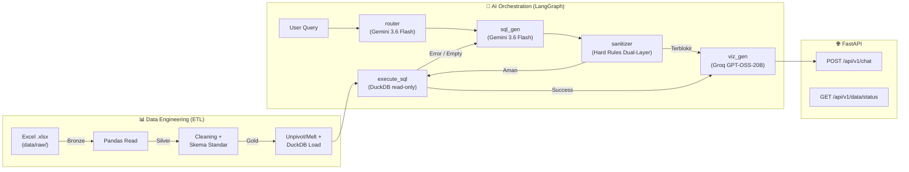
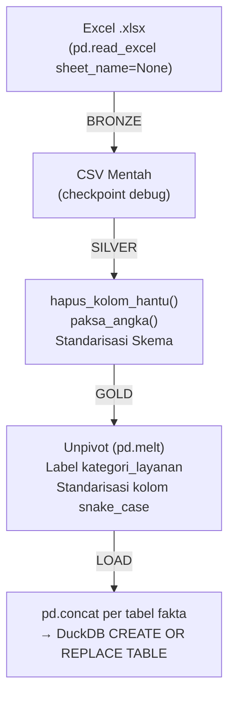
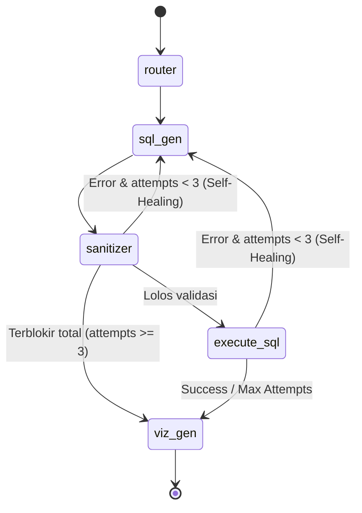

# 🔍 Deep Dive: Proyek RAG Komersial TPS

Analisis komprehensif seluruh proyek **AI Data Agent** untuk PT Terminal Petikemas Surabaya.

---

## 1. Visi & Tujuan Proyek

Proyek ini adalah **Tugas Akhir** oleh Nabiel Nizar Anwari (NIM 5027231087, ITS) yang membangun **AI Data Agent** berbasis:
- **Multi-Agent Text-to-SQL** — LLM menerjemahkan bahasa natural → SQL DuckDB
- **Medallion Architecture** — ETL pipeline tiga lapis (Bronze → Silver → Gold)
- **Self-Healing Loop** — Koreksi mandiri SQL hingga 3 kali percobaan

**Studi kasus:** Divisi Komersial PT TPS, mengolah data operasional pelabuhan petikemas (vessel, throughput, market share, transhipment, dll).

---

## 2. Arsitektur Sistem (High-Level)



---

## 3. Struktur Direktori Proyek

```
rag-komersial-tps/
├── README.md                    # Blueprint arsitektur (judul TA)
├── SYSTEM_CONTEXT.md            # Technical blueprint & system prompt reference
├── requirements.txt             # Dependencies Python
├── test_db.py                   # Skrip tes koneksi DuckDB
├── test_viz.py                  # Skrip tes VizGen node
│
├── backend/
│   ├── .env                     # API keys (Gemini)
│   ├── BACKEND.MD               # Dokumentasi developer backend
│   ├── main.py                  # Entry point FastAPI
│   ├── lihatdata.py             # Helper inspeksi DuckDB
│   ├── agents/                  # Orkestrasi AI (LangGraph)
│   │   ├── state.py             # AgentState TypedDict (+ relevant_tables)
│   │   ├── graph.py             # StateGraph builder + dual conditional edges
│   │   ├── router.py            # Node 1: Router Agent (Gemini 3.6 Flash)
│   │   ├── sql_gen.py           # Node 2: Text-to-SQL (Gemini 3.6 Flash)
│   │   ├── sanitizer.py         # Node 3: Hard Rules Dual-Layer Sanitizer
│   │   ├── execute.py           # Node 4: Eksekusi SQL + deteksi empty
│   │   └── viz_gen.py           # Node 5: NLG + ECharts JSON (Groq openai/gpt-oss-20b)
│   ├── etl/                     # Pipeline Medallion
│   │   ├── main_etl.py          # Orchestrator ETL (router per file)
│   │   ├── transformers.py      # Fungsi transformasi per dataset
│   │   └── utils.py             # Helpers: cleaning, logging, debug CSV
│   └── tests/                   # Unit tests (pytest)
│       ├── test_etl.py          # 4 test cases ETL pipeline
│       ├── test_router.py       # 1 test case Router Agent
│       └── test_sanitizer.py    # 5 test cases (termasuk SQL Injection)
│
├── frontend/                    # Vue 3 + Vite + Tailwind CSS
│   ├── index.html               # Entry HTML + ECharts CDN + Google Fonts
│   ├── package.json             # Dependencies (vue, vite, tailwindcss)
│   ├── vite.config.js           # Proxy /api → localhost:8000
│   ├── tailwind.config.js       # Custom dark theme config
│   └── src/
│       ├── main.js              # Vue app mount
│       ├── App.vue              # Root layout + chat state
│       ├── style.css            # Tailwind + custom CSS (card-executive, bg-mesh)
│       └── components/
│           ├── Navbar.vue       # Header corporate PT TPS + logo fallback
│           ├── PromptSuggestions.vue  # 3 interactive analytics cards
│           ├── ChatMessage.vue  # Bubble percakapan + markdown parser
│           ├── ChatInput.vue    # Command palette + rotating loading
│           ├── SqlAccordion.vue # Collapsible SQL viewer + copy button
│           ├── EChartsViewer.vue # Dynamic chart + sanitizeChartOption()
│           ├── DataTableModal.vue # Collapsible raw data table
│           └── Icons.js         # Zero-dependency SVG icon set
│
├── data/
│   ├── raw/                     # 9 file Excel sumber (.xlsx)
│   ├── bronze/                  # CSV checkpoint (data mentah)
│   ├── silver/                  # CSV checkpoint (data bersih)
│   ├── gold/                    # CSV checkpoint (data matang)
│   └── processed/
│       └── tps_komersial.duckdb # Database persisten (~2.1 MB)
│
├── milestone/                   # Dokumentasi per fase
│   ├── MILESTONE1.MD            # ETL Pipeline ✅
│   ├── MILESTONE2.MD            # Text-to-SQL Core ✅
│   ├── MILESTONE3.MD            # Self-Healing + Semantic Layer ✅
│   └── MILESTONE4.MD            # Visualisasi ECharts ✅
│
└── logs/                        # ETL system logs (RotatingFileHandler)
```

---

## 4. Pipeline ETL (Medallion Architecture)

### 4.1 Sumber Data (9 File Excel)

| File Excel | Ukuran | Deskripsi |
|---|---|---|
| `Container Throughput.xlsx` | 18 KB | KPI throughput container (Domestik + Internasional) |
| `Komersial Dashboard.xlsx` | 186 KB | Dashboard agregat komersial |
| `Market Share.xlsx` | 467 KB | Data pangsa pasar per operator |
| `OVERVIEW BOX.xlsx` | 72 KB | Ringkasan operasi box/container |
| `OVERVIEW VESSEL.xlsx` | 119 KB | Operasional kapal per bulan |
| `Realisasi UC.xlsx` | 269 KB | Realisasi Unit Cost |
| `RestNDisc.xlsx` | 15 KB | Restitusi & Diskon |
| `Transhipment.xlsx` | 1.4 MB | Data transhipment (terbesar) |
| `VESSEL SERVICE.xlsx` | 471 KB | Layanan kapal detail |

> **PENTING:**
> Saat ini hanya **3 file** yang di-route oleh ETL (`FILE_ROUTER` di `main_etl.py`):
> - `OVERVIEW VESSEL.xlsx` → `proses_vessel` → tabel `fakta_vessel`
> - `Container Throughput.xlsx` → `proses_throughput` → tabel `fakta_throughput`
> - `Market Share.xlsx` → `proses_market_share` → tabel `fakta_market_share`
>
> **6 file lainnya** (Komersial Dashboard, Realisasi UC, RestNDisc, Transhipment, VESSEL SERVICE, OVERVIEW BOX) **belum memiliki transformer** dan belum diproses ke DuckDB.

### 4.2 Alur Transformasi



### 4.3 Fungsi Utilitas Kunci (`utils.py`)

| Fungsi | Tujuan |
|---|---|
| `hapus_kolom_hantu` | Hapus kolom Unnamed, baris/kolom NaN, replace dash "-" → 0, rename "%" → "persentase", disambiguasi kolom TEUS duplikat |
| `paksa_angka` | Konversi string ke numerik (hapus koma ribuan, coerce errors → 0) |
| `pastikan_kolom_unik` | Cegah error concat akibat kolom duplikat |
| `simpan_debug_csv` | Simpan checkpoint CSV per layer jika `DEBUG_MODE=True` |

---

## 5. Database DuckDB — Skema & Data

File: `data/processed/tps_komersial.duckdb` (~2.1 MB)

### 5.1 Tabel Inti (Fakta) — Hasil ETL Konsolidasi

Berdasarkan `FILE_ROUTER`, dihasilkan **3 tabel fakta utama**:

#### Tabel `fakta_vessel`
Sumber: `OVERVIEW VESSEL.xlsx` (sheet Domestic + International digabung)
| Kolom | Deskripsi |
|---|---|
| `date`, `year`, `month_code`, `month` | Dimensi waktu |
| `lop` | Line Operator (EMC, SSL, CNC, MSC, SPI, TIL, dll) |
| `teus`, `boxes`, `bch`, `bsh` | Metrik operasional kapal |
| `kategori_layanan` | 'DOMESTIC' atau 'INTERNATIONAL' |

#### Tabel `fakta_throughput`
Sumber: `Container Throughput.xlsx` (sheet Domestik + International)
| Kolom | Deskripsi |
|---|---|
| `year`, `month`, `description`, `unit` | Dimensi & deskripsi |
| `actual`, `budget`, `actual_vs_budget` | KPI throughput vs target |
| `kategori_layanan` | 'DOMESTIK' atau 'INTERNATIONAL' |

#### Tabel `fakta_market_share`
Sumber: `Market Share.xlsx` (multi-sheet, termasuk Unpivot kolom tahun)
| Kolom | Deskripsi |
|---|---|
| `lop` | Line Operator |
| `teus`, `persentase` | Volume & pangsa pasar |
| `tahun_kategori`, `total_teus` | Hasil Unpivot kolom tahun |
| `sumber_sheet` | Asal sheet (SL DOM, SL INT, B.OPR DOM, dll) |

### 5.2 Tabel Sheet Individu (Gold Layer CSVs)

Selain 3 tabel konsolidasi, gold layer juga menghasilkan 17 CSV terpisah yang merepresentasikan tiap sheet individual. Data-data ini semuanya dimuat ke DuckDB (masing-masing jadi tabel tersendiri karena proses `pd.concat` per `nama_tabel`).

> **CATATAN:**
> Karena semua sheet dari `Market Share.xlsx` di-route ke `proses_market_share` yang mengembalikan `nama_tabel = "fakta_market_share"`, semua sheet-nya akan digabung (concat) ke satu tabel. Demikian juga untuk vessel dan throughput.

---

## 6. Orkestrasi AI (LangGraph Multi-Agent)

### 6.1 State Machine

Didefinisikan di `state.py`:

```python
class AgentState(TypedDict):
    user_query: str                       # Pertanyaan asli dari user
    relevant_tables: Optional[List[str]]  # Tabel terpilih oleh Router Agent
    generated_sql: Optional[str]          # SQL rakitan LLM
    sql_error: Optional[str]              # Error message (trigger self-healing)
    correction_attempts: int              # Counter percobaan (max 3)
    query_result: Optional[List[dict]]    # Hasil DuckDB
    final_answer: Optional[str]           # Narasi jawaban
    echarts_config: Optional[dict]        # JSON konfigurasi grafik
```

### 6.2 Graf Eksekusi (`graph.py`)



Terdapat dua fungsi conditional router:
- `should_continue_sanitizer` — 3-way routing (sql_gen / execute_sql / viz_gen)
- `should_continue` — 2-way routing (sql_gen / viz_gen)

### 6.3 Node 1: SQL Generator (`sql_gen.py`)

- **LLM:** `gemini-3.6-flash` via `langchain-google-genai`
- **Dynamic Schema Injection:** Query `information_schema.columns` real-time dari DuckDB
- **Semantic Layer (Glosarium Bisnis):**
  - "Domestik" → `DOMESTIC` / `DOM`
  - "Internasional" → `INTERNATIONAL` / `INT`
  - Kolom "Unit" = `TEUs`, bukan `BOXES`
  - Wajib `ILIKE` untuk case-insensitive
- **Self-Healing Input:** Menerima `sql_error` dari percobaan sebelumnya dalam prompt

### 6.4 Node 2: SQL Executor (`execute.py`)

- Eksekusi SQL di DuckDB (read-only mode)
- **Deteksi data kosong:**
  - 0 baris → empty
  - 1 baris, semua value `None`/`NaN` → empty (aggregasi null)
- Increment `correction_attempts` untuk trigger self-healing
- Convert datetime columns ke string untuk serialisasi JSON

### 6.5 Node 3: Hard Rules Sanitizer (`sanitizer.py`)

- **Tanpa LLM** — sepenuhnya berbasis rule/regex
- **Dual-Layer Guard:**
  - **Input Guard:** Memeriksa `user_query` terhadap `;`, keyword DDL/DML (`DROP`, `DELETE`, `INSERT`, dll), dan syntax komentar SQL (`--`, `/*`)
  - **Output Guard:** Memeriksa `generated_sql` terhadap multiple statements, keyword terlarang, dan validasi tabel terhadap skema DuckDB
- Jika terdeteksi serangan, `correction_attempts` dipaksa ke `3` (max) → langsung blokir tanpa retry

### 6.6 Node 4: SQL Executor (`execute.py`)

(Sama seperti sebelumnya, dengan tambahan defense-in-depth guard: jika `sql_error` mengandung `SANITIZER BLOCKED`, eksekusi DuckDB langsung dibatalkan)

### 6.7 Node 5: Visualization Generator (`viz_gen.py`)

- **LLM:** `openai/gpt-oss-20b` via `langchain-groq` (Groq Inference Engine)
- **Pydantic Structured Output** (`VizOutput`) memaksa output terstruktur:
  - `answer`: Narasi teks profesional
  - `echarts_config`: JSON Apache ECharts (bar/line/pie) atau dict kosong
- Data dibatasi maksimal 50 baris pertama untuk mencegah rate limit TPM pada tier gratis Groq
- Jika Sanitizer memblokir, langsung mengembalikan pesan penolakan keamanan resmi tanpa memanggil LLM

> **CATATAN:**
> Arsitektur menggunakan strategi **Dual-LLM**: Gemini 3.6 Flash untuk Reasoning & Text-to-SQL (`router`, `sql_gen`), dan Groq `openai/gpt-oss-20b` untuk kecepatan generasi narasi & visualisasi (`viz_gen`).

---

## 7. API Layer (`main.py`)

### Endpoints

| Method | Path | Fungsi |
|---|---|---|
| `POST` | `/api/v1/chat` | Terima query → jalankan LangGraph → return answer + chart |
| `GET` | `/api/v1/data/status` | Cek status ETL (saat ini di-mock) |

### Request/Response Model

```python
# Request
class ChatRequest(BaseModel):
    query: str
    user_id: str = "guest"
    role: str = "commercial"

# Response
class ChatResponse(BaseModel):
    status: str              # "success" | "error"
    answer: str              # Narasi jawaban
    chart_config: dict | None  # ECharts JSON
    sql_executed: str | None   # SQL yang dieksekusi
    error: str | None          # Pesan error (jika ada)
    data: list | None          # Raw query result
```

> **PERINGATAN:**
> CORS dikonfigurasi `allow_origins=["*"]` — ini aman untuk prototyping tapi **HARUS diubah** untuk production.

---

## 8. Progress Milestone

| Milestone | Status | Deliverable |
|---|---|---|
| **M1** — Data Engineering ETL | ✅ Selesai | Pipeline Medallion, 3 tabel fakta di DuckDB |
| **M2** — AI Text-to-SQL Core | ✅ Selesai | FastAPI + LangGraph + Gemini 3.6 Flash |
| **M3** — Advanced Orchestration | ✅ Selesai | Semantic Layer, Self-Healing Loop (max 3 retry), Router Agent |
| **M4** — Visualisasi ECharts | ✅ Selesai | Pydantic Structured Output, echarts_config JSON |
| **M5** — Frontend UI/UX | ✅ Selesai | Vue 3 + Vite + Tailwind CSS + Apache ECharts CDN, 8 komponen |

---

## 9. Gap Analysis & Temuan Penting

### 🔴 Isu Kritis (Belum Terselesaikan)

1. **6 dari 9 file Excel belum diproses ETL**
   - `Komersial Dashboard.xlsx`, `Realisasi UC.xlsx`, `RestNDisc.xlsx`, `Transhipment.xlsx` (1.4 MB, file terbesar!), `VESSEL SERVICE.xlsx`, `OVERVIEW BOX.xlsx` — semua belum punya transformer
   - Artinya LLM hanya bisa menjawab pertanyaan seputar vessel, throughput, dan market share

2. **Belum ada RBAC (Role-Based Access Control)**
   - `user_id` dan `role` diterima di request tapi **tidak digunakan** di LangGraph
   - Tidak ada `RBACNode` atau `CheckCacheNode` yang di-mention di blueprint

3. **Belum ada Redis Semantic Cache**
   - Disebutkan di arsitektur tapi belum diimplementasi

### 🟡 Isu Sedang (Sebagian Sudah Diperbaiki)

4. ~~Inkonsistensi `kategori_layanan` `DOMESTIK` vs `DOMESTIC`~~ → ✅ **DIPERBAIKI** via `_normalisasi_nama_sheet()` (perlu re-ETL untuk memastikan data lama ternormalisasi)

5. ~~`DUCKDB_PATH` relative path konflik~~ → ✅ **DIPERBAIKI** (`BASE_DIR` absolut, `.env` dibersihkan)

6. ~~Tidak ada unit test formal~~ → ✅ **DIPERBAIKI** (3 file test, 10 test cases: `test_etl.py`, `test_router.py`, `test_sanitizer.py`)

7. ~~Belum ada frontend~~ → ✅ **SELESAI** (Vue 3 + Vite + Tailwind CSS, 8 komponen)

8. ~~Belum ada Router Agent~~ → ✅ **SELESAI** (`router.py`, Gemini 3.6 Flash)

9. ~~Hard Rules Sanitizer belum ada~~ → ✅ **SELESAI** (`sanitizer.py`, Dual-Layer Guard)

10. **CORS `allow_origins=["*"]`** — aman untuk prototyping tapi harus diubah untuk production

### 🟢 Hal Positif

11. **ETL sangat rapi** — Logging dengan RotatingFileHandler, debug CSV checkpoint, modular transformers
12. **Self-Healing bekerja baik** — Deteksi syntax error + empty result + pesan teguran kontekstual
13. **Single-LLM strategy (Gemini 3.6 Flash)** — konsisten dan menghindari rate limit Groq
14. **Pydantic Structured Output** di viz_gen — mencegah LLM menghasilkan JSON yang rusak
15. **Dokumentasi sangat baik** — Setiap milestone didokumentasikan dengan jelas dan naratif
16. **Keamanan Dual-Layer Sanitizer** — memblokir SQL Injection di level input (user_query) dan output (generated_sql)

---

## 10. Tech Stack Aktual vs Rencana

| Komponen | Rencana (README) | Implementasi Aktual |
|---|---|---|
| Backend | FastAPI | ✅ FastAPI |
| Database | DuckDB Persistent | ✅ DuckDB |
| ETL | Pandas + Medallion | ✅ Pandas (3/9 file) |
| Orchestrator | LangGraph | ✅ LangGraph (5 nodes) |
| LLM (Router) | — | ✅ Gemini 3.6 Flash |
| LLM (SQL) | Gemini 1.5 Flash | ✅ Gemini 3.6 Flash |
| LLM (Viz) | Gemini / Groq | ✅ Groq `openai/gpt-oss-20b` |
| Security | Hard Rules Sanitizer | ✅ Dual-Layer Guard (Input + Output) |
| Validasi Data | Pandera/Pydantic | ❌ Belum ada (manual cleaning saja) |
| Cache | Redis Semantic | ❌ Belum ada |
| Scheduler | APScheduler/Watchdog | ❌ Belum ada (ETL manual) |
| Frontend | Vue.js 3 + Tailwind + ECharts | ✅ Vue 3 + Vite + Tailwind + ECharts CDN |

---

## 11. Peta Jalan: Apa yang Perlu Dikerjakan Selanjutnya

Berdasarkan analisis di atas, urutan prioritas pengembangan:

### Milestone 5 — Frontend UI/UX ✅ SELESAI
- [x] Inisialisasi Vue 3 project di folder `frontend/` (Vite)
- [x] Integrasi Tailwind CSS & Executive Dark Theme
- [x] 8 Komponen Vue (Navbar, ChatMessage, ChatInput, EChartsViewer, SqlAccordion, DataTableModal, PromptSuggestions, Icons)
- [x] Render Apache ECharts dari `echarts_config` JSON + `sanitizeChartOption()` auto-fix
- [x] Responsive design & rotating loading messages
- [x] Logo PT TPS fallback otomatis
- [x] Markdown bold/italic parser pada bubble jawaban AI

### Backend Enhancements — Status
- [ ] Tambah transformer untuk 6 file Excel yang belum diproses
- [x] Implementasi Router Agent (pilih tabel relevan)
- [x] Implementasi Hard Rules Sanitizer (Dual-Layer Guard)
- [x] Migrasi Viz Gen dari Groq ke Gemini 3.6 Flash
- [x] Endpoint `/api/v1/data/status` riil (query DuckDB)
- [x] Fix inkonsistensi `DOMESTIK` vs `DOMESTIC`
- [x] Unit tests formal (10 test cases)
- [ ] Implementasi RBAC (filter berdasarkan role)
- [ ] Setup Redis Semantic Cache
- [ ] Validasi Data Contract (Pandera/Pydantic)

---

> **TIP:**
> **Untuk developer baru:** Jika AI mulai keliru, hal pertama yang harus diperiksa adalah **Glosarium di `sql_gen.py`**. Tambahkan fakta bisnis baru ke dalam prompt untuk "mendidik" AI.
