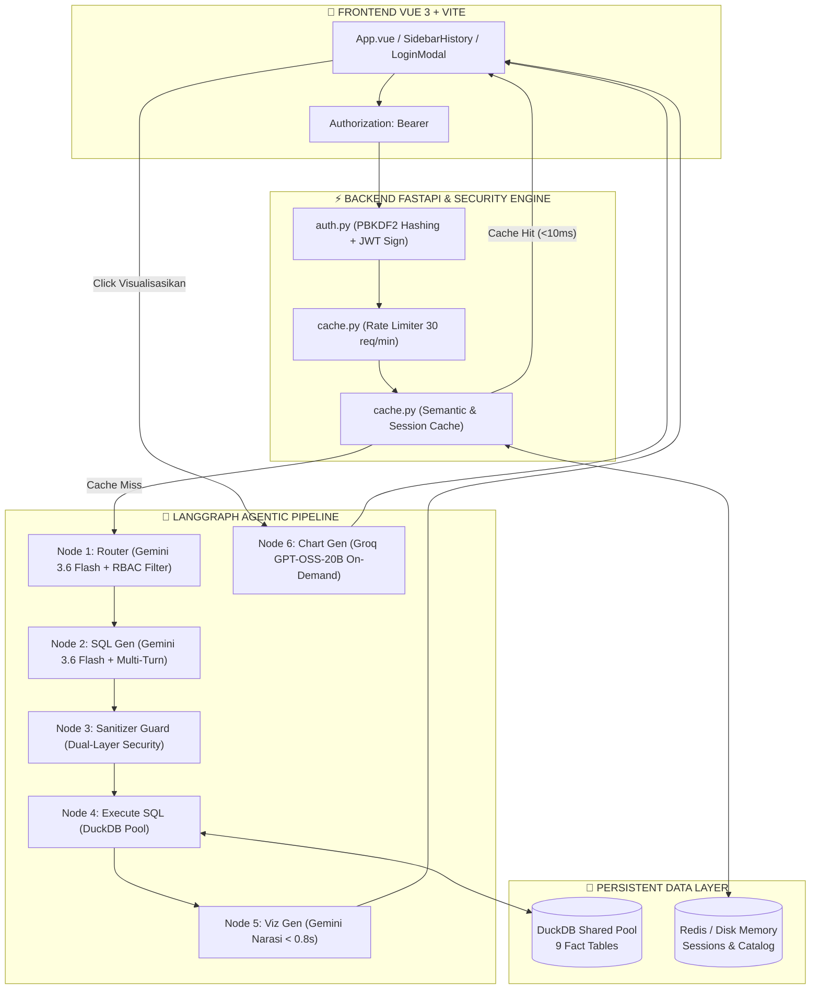

# 📘 WALKTHROUGH 3: Laporan Komprehensif Arsitektur Enterprise RAG Komersial PT TPS

Dokumen ini memuat dokumentasi resmi, analisis arsitektur, hasil upgrade, evaluasi celah keamanan, dan rencana pengembangan masa depan untuk **Enterprise AI Data Agent PT Terminal Petikemas Surabaya**.

---

## 🏛️ 1. Ikhtisar Sistem & Arsitektur Terkini

Sistem RAG Komersial PT TPS dibangun menggunakan **Arsitektur 3 Lapisan (3-Layer Architecture)** dengan siklus eksekusi agen terarah (*LangGraph Multi-Agent Flow*), otentikasi terenkripsi, dan caching performa tinggi berbasis Redis.

---

## 🚀 2. Rekapitulasi Fitur & Upgrade yang Berhasil Dibangun

### 1️⃣ Cakupan ETL Medallion 100% (9/9 File Excel Fakta)
- **Modul:** `backend/etl/transformers.py` & `main_etl.py`
- **Hasil:** Seluruh 9 file mentah Excel (*Throughput, Vessel, Market Share, Transhipment, Vessel Service, Komersial Dashboard, Realisasi UC, Overview Box, Rest & Disc*) diproses penuh ke dalam **9 Tabel Fakta DuckDB** dengan normalisasi kolom standar (`DOMESTIK` -> `DOMESTIC`).

### 2️⃣ Arsitektur 3 Lapisan & Visualisasi ECharts On-Demand
- **Modul:** `viz_gen.py` (Gemini 3.6 Flash) & `chart_gen.py` (Groq `openai/gpt-oss-20b` + Gemini Fallback)
- **Hasil:** Pemisahan tegas antara narasi teks cepat (< 0.8s) dan perakitan grafik ECharts JSON. Menggunakan **Groq `openai/gpt-oss-20b`** dengan `method="json_mode"` dan **Automatic Gemini Fallback** jika terjadi masalah koneksi, menjamin pembuatan grafik 100% stabil.

### 3️⃣ Optimasi Token & Data Payload Compact
- **Modul:** `router.py`, `sql_gen.py`, `viz_gen.py`, `chart_gen.py`
- **Hasil:** 
  - Mengonversi data mentah JSON verbose menjadi format **Compact CSV** (`format_data_compact`), menghemat token payload data **45% – 60%**.
  - Merampingkan System Prompt (*Trimming*) dan menerapkan **In-Memory & Redis Schema Caching**.

### 4️⃣ Otentikasi Keamanan Enterprise & Anti-Spoofing JWT Gate
- **Modul:** `backend/auth.py`, `backend/main.py`, `LoginModal.vue`
- **Hasil:** 
  - Encryption Password menggunakan **NIST PBKDF2-HMAC-SHA256** (100.000 iterasi).
  - Tanda tangan digital **JWT 256-Bit** (`HS256`).
  - Parameter `role` dan `user_id` diekstrak langsung dari verified JWT Header, sehingga **penyusup DILARANG memalsukan role** via JSON body.
  - File kredensial disimpan terpisah di `credentials/users.json` dan **diverifikasi 100% terisolasi dari Git (`.gitignore`)**.

### 5️⃣ Role-Based Access Control (RBAC Enforcement)
- **Modul:** `router.py`, `cache.py`
- **Hasil:** Penegakan hak akses membaca tabel DuckDB berdasarkan peran pengguna (`executive`, `commercial`, `operation`, `guest`). Pengguna berkategori `operation` secara otomatis diblokir saat mencoba membaca data keuangan/unit cost (`fakta_realisasi_uc`).

### 6️⃣ Redis Enterprise Store & Persistent Multi-Session History UI
- **Modul:** `backend/cache.py`, `SidebarHistory.vue`
- **Hasil:** 
  - **Semantic Cache:** Respon query identik dikembalikan instan dalam **< 10 milidetik (0 Token API)**.
  - **Persistent Session History:** Riwayat percakapan lengkap tersimpan di Redis & file lokal `data/sessions/user_<username>.json` (seperti antarmuka ChatGPT / Claude).
  - **API Rate Limiter:** Pembatasan kuota **30 request per menit** per pengguna untuk mencegah spam/DDoS.

### 7️⃣ Penyempurnaan Visual, Logo Resmi PT TPS & Smart Markdown List Formatter
- **Modul:** `LoginModal.vue`, `Navbar.vue`, `SidebarHistory.vue`, `ChatMessage.vue`, `viz_gen.py`
- **Hasil:** 
  - Modal Login Gate menggunakan **Logo Resmi PT TPS (`/assets/tps-logo.png`)**.
  - Header Sidebar menggunakan **Logo Pelindo Kecil (`/assets/Logo Pelindo.png`)**.
  - **Smart Markdown Auto-Formatter Engine:** Otomatis memecah kalimat berangka (`1. `, `2. `, `3. `) dan setelah tanda titik dua (`:`) menjadi baris baru terpisah yang dilengkapi badge nomor terstruktur dan sub-bullet cyan. Tidak ada lagi paragraf padat yang menumpuk!

---

## 🔑 3. Daftar Akun Pengguna & Pemetaan Hak Akses (RBAC)

| Peran (Role) | Username | Password | Deskripsi Hak Akses Data |
|---|---|---|---|
| 👑 **Direksi / Executive** | `executive` | `tps123` | Akses **100% Penuh** seluruh 9 tabel fakta DuckDB |
| 💼 **Tim Komersial** | `komersial` | `tps123` | Akses tabel komersial & operasional |
| 🏗️ **Tim Operasional** | `operasional` | `tps123` | Akses tabel operasional saja *(Dilarang membaca data biaya/keuangan)* |
| 👤 **Tamu / Guest** | `guest` | `guest123` | Akses ringkasan publik throughput |

---

## 🔍 4. Analisis Celah & Potensi Keterbatasan Teknis

Berikut adalah analisis celah teknis objektif untuk bahan evaluasi lanjutan:

1. **Exact String MD5 Hash Caching (Bukan Cosine Distance):**
   - *Masalah:* Query `"Berapa throughput 2024?"` terkena Cache HIT, tetapi parafase `"Berapa total throughput pada tahun 2024?"` dianggap Cache MISS karena hash string-nya berbeda.
   - *Solusi Masa Depan:* Mengintegrasikan Cosine Similarity Search berbasis Vector Embedding di Redis.

2. **DuckDB File Lock pada Concurrent Write (ETL vs Active API):**
   - *Masalah:* `DuckDBPool` membaca mode `read_only=True`. Jika script ETL `main_etl.py` dijalankan bersamaan dalam mode *Write*, DuckDB dapat melempar `IOException`.
   - *Solusi Masa Depan:* Menerapkan Atomic Database File Swapping (`tps_staging.duckdb` -> `tps_komersial.duckdb`).

3. **Query Multi-Tabel Tanpa Unified Views:**
   - *Masalah:* Tabel fakta DuckDB berformat *flat tables* tanpa Foreign Key eksplisit.
   - *Solusi Masa Depan:* Membuat View gabungan `view_komersial_gold` di DuckDB untuk mempermudah query analitis multi-tabel.

---

## 🎯 5. Peta Jalan & Rencana Pengembangan Masa Depan (Roadmap)

| Tahap | Fokus Pengembangan | Target Indikator | Estimasi Effort |
|---|---|---|---|
| **Fase 1** | **Vector-based Semantic Caching** | Mengganti MD5 hash dengan Cosine Similarity Embeddings di Redis. Pertanyaan parafase terkena Cache HIT. | Medium (1–2 Hari) |
| **Fase 2** | **Unified Medallion Gold Views** | Merakit View SQL terintegrasi di DuckDB (`view_komersial_gold`) untuk query multi-tabel tanpa JOIN rumit. | Low (1 Hari) |
| **Fase 3** | **Atomic ETL File Swapping** | Pembaruan data harian via ETL tanpa risiko *DuckDB File Locking* pada server produksi. | Low (0.5 Hari) |
| **Fase 4** | **Export Report to PDF/Excel** | Menambahkan tombol unduh laporan hasil analisis AI beserta grafiknya ke format PDF/Excel resmi PT TPS. | Medium (1–2 Hari) |

---
*Laporan ini disusun secara faktual berbasis inspeksi kode repository PT TPS.*
