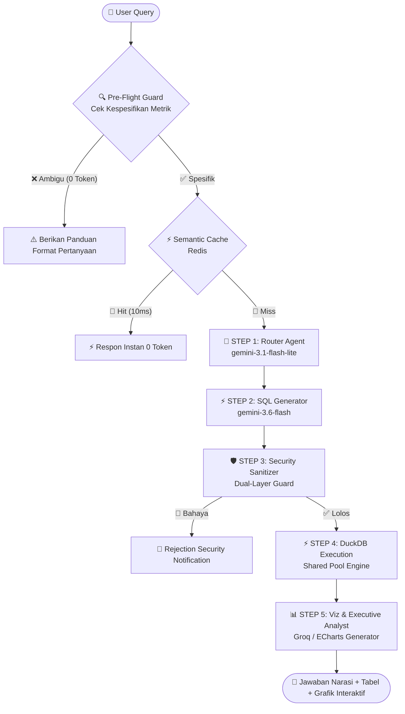

# 📘 Handover & Blueprint Sistem V2.0: TPS Enterprise AI Data Agent

**Tanggal:** September 2026  
**Status Proyek:** Stable / Production-Ready (Version 2.0)  
**Tujuan Dokumen:** Dokumen ini bertindak sebagai **Peta Arsitektur, Blueprint Teknis, dan Ground Truth** komprehensif bagi pengembang baru, stakeholder, maupun model AI eksternal untuk memahami seluruh arsitektur sistem dari Data Engineering, Multi-Agent LangGraph (STEP 1 s/d STEP 5), lapisan keamanan guardrail, hingga manajemen kunci API per-step.

---

## 🎯 1. Gambaran Umum Sistem (Executive Summary)

Aplikasi ini adalah **Enterprise AI Data Agent** berstandar industri yang dirancang khusus untuk menganalisis data finansial, operasional kapal, dan throughput petikemas **PT Terminal Petikemas Surabaya (TPS)**.

Alih-alih sekadar menjadi *chatbot* percakapan biasa, agen ini mengorkestrasi pipeline multi-agen mandiri yang:
1. Menerjemahkan bahasa manusia menjadi query analitik database murni (**Text-to-SQL**).
2. Mengeksekusinya ke database OLAP lokal berkecepatan tinggi (**DuckDB Engine**).
3. Mengubah hasil data mentah menjadi narasi bisnis eksekutif dan grafik visual interaktif (**Apache ECharts**).

### 🏆 Tiga Pilar Utama Sistem V2.0:
1. **Zero Data Leakage:** Seluruh data operasional perusahaan tetap berada di server lokal (DuckDB). LLM hanya menerima nama skema kolom dan bertugas merakit sintaks SQL.
2. **Extreme Token & Cost Efficiency:** Menerapkan *Pre-Flight Query Specificity Guard*, *Fail-Fast Mechanism*, *SQL-Only History Injection*, dan *15-Row Data Sampling* untuk memangkas konsumsi token hingga 85%.
3. **Dedicated Multi-Provider Flexibility:** Memisahkan manajemen API Key dan Model AI secara independen untuk tiap tahapan (Step 1, Step 2, dan Step 5).

---

## 🏗️ 2. Tumpukan Teknologi (Tech Stack)

### A. Backend Layer
- **Framework:** `FastAPI` (Python 3.11+)
- **Analytical Database (OLAP):** `DuckDB` (`data/processed/tps_komersial.duckdb` - Shared Connection Pool)
- **In-Memory Cache & Session:** `Redis` (Shared Schema Cache & Multi-Session Context Memory)
- **Persistent Storage:** Dual-Layer JSON File Storage (`data/sessions/user_<username>.json`)
- **Authentication & Security:** JWT (JSON Web Tokens), PBKDF2 Password Hashing, & Dual-Layer Sanitizer

### B. AI & Multi-Agent Layer
- **Orkestrator:** `LangGraph` (State Machine linier Fail-Fast)
- **STEP 1 (Router):** Google Gemini (`gemini-3.1-flash-lite` / `gemini-2.5-flash-lite`) via `langchain-google-genai`
- **STEP 2 (SQL Gen):** Google Gemini (`gemini-3.6-flash` / `gemini-3.1-pro`) via `langchain-google-genai`
- **STEP 5 (Viz & Analyst):** Groq Cloud (`openai/gpt-oss-20b` / `llama-3.3-70b-versatile`) via `langchain-groq`

### C. Frontend Layer
- **Framework:** `Vue 3` (Composition API) + `Vite`
- **Styling:** `Tailwind CSS` (Glassmorphism & Dark Mode Theme)
- **Interactive Charting:** `Apache ECharts` (via `vue-echarts`)

---

## 🤖 3. Detail Arsitektur Multi-Agent (STEP 1 s/d STEP 5)

---

### 🧭 STEP 1: Semantic Routing & RBAC Filtering
* **File:** `backend/agents/router.py`
* **Default Model:** `gemini-3.1-flash-lite`
* **Fungsi:** 
  1. Menganalisis pertanyaan bisnis pengguna dan mencocokkannya dengan **Katalog 9 Tabel DuckDB** yang telah diperkaya deskripsi semantiknya.
  2. Menerapkan RBAC (*Role-Based Access Control*) sesuai profil login (*Executive*, *Commercial*, *Operation*, *Guest*).
* **Output:** Daftar nama tabel relevan (contoh: `['fakta_throughput']`).
* **Optimasi Token:** **Schema Pruning** — Hanya meloloskan 1–2 tabel relevan ke Step 2, memangkas 80% skema yang tidak terpakai dari prompt SQL Generator.

---

### ⚡ STEP 2: Text-to-SQL Generation
* **File:** `backend/agents/sql_gen.py`
* **Default Model:** `gemini-3.6-flash`
* **Fungsi:**
  1. Menerjemahkan bahasa manusia menjadi query SQL DuckDB yang valid.
  2. Menerapkan **Glosarium Domain PT TPS**:
     - *Throughput Petikemas* ➔ Kategori `'INTERNATIONAL'` atau `'DOMESTIC'`. (Tidak memfilter kata redundant 'peti kemas' / 'container').
     - *Pendapatan Pelanggan* ➔ Wajib menggabungkan `COALESCE(total_all_revenue, total_revenue) AS total_revenue`.
     - *Pencarian String* ➔ Wajib menggunakan operator case-insensitive `ILIKE`.
* **Output:** Sintaks DuckDB SQL murni tanpa markdown/backticks.
* **Optimasi Token:** **SQL-Only History** — Jika merupakan pertanyaan lanjutan, prompt hanya menerima kueri SQL sebelumnya, membuang teks narasi panjang 1.000 kata.

---

### 🛡️ STEP 3: Dual-Layer Security Sanitizer
* **File:** `backend/agents/sanitizer.py`
* **Engine:** *Python-Native Rule Engine (0 Token LLM / <1ms Latency)*.
* **Fungsi:**
  1. **Input Guard:** Memeriksa pertanyaan pengguna dari percobaan SQL Injection, multiple statements (`;`), komentar SQL (`--`, `/* */`), dan kata kunci berbahaya (`DROP`, `DELETE`, `UPDATE`, `INSERT`, `TRUNCATE`, `ALTER`).
  2. **Output Guard:** Memverifikasi bahwa seluruh tabel dan alias CTE (`WITH ... AS`) pada SQL hasil rakitan LLM benar-benar valid di database DuckDB.
* **Output:** Jika aman, kueri diteruskan ke Step 4. Jika melanggar, eksekusi DuckDB dibatalkan seketika dan dialihkan ke Step 5 untuk graceful notification.

---

### 🗄️ STEP 4: High-Performance DuckDB Execution Engine
* **File:** `backend/agents/execute.py` & `backend/db.py`
* **Engine:** DuckDB Shared Connection Pool.
* **Fungsi:**
  1. Mengeksekusi SQL query langsung ke file `data/processed/tps_komersial.duckdb`.
  2. **Sanitasi Numerik:** Mengonversi nilai numerik `NaN` / `Infinity` menjadi `null` standar JSON agar kompatibel dengan browser.
  3. **Fail-Fast Empty Detection:** Jika kueri menghasilkan 0 baris atau nilai all-null, langsung menandai status `DATA_EMPTY` dan mengalirkan status ke Step 5 tanpa perulangan (*no retry loop*).
* **Output:** `query_result` (list of dict records).

---

### 📊 STEP 5: Executive Business Narrative & Chart Generation
* **File:** `backend/agents/viz_gen.py` & `backend/agents/chart_gen.py`
* **Default Model:** Groq Cloud `openai/gpt-oss-20b`
* **Fungsi:**
  1. **Executive Narrative:** Merangkum data angka menjadi narasi bisnis berstruktur rapi, satuan standar pelabuhan (*TEUs*, *Boxes*, *Rp* berpemisah titik ribuan, penomoran resmi `1. `, `2. `).
  2. **Smart Data Row Sampling:** Mengirimkan **maksimal 15 baris sampel teratas + total hitungan baris** ke LLM untuk membuat narasi (hemat token ~80%).
  3. **On-Demand Visualisasi:** Otomatis menghasilkan grafik Apache ECharts interaktif (Bar, Line, Donut) jika pengguna meminta grafik/tren.
  4. **Graceful Degradation:** Jika data kosong (`DATA_EMPTY`), memberikan saran panduan ramah tentang cara memperjelas pencarian.

---

## ⚡ 4. Fitur Mutakhir & Optimasi Utama (V2.0 Update)

| Fitur | Deskripsi & Dampak |
| :--- | :--- |
| **🛡️ Pre-Flight Specificity Guard** | Mendeteksi kueri ambigu/tidak jelas (*"berapa total 2025"*). Langsung ditolak di lapisan awal dalam **0 ms dan 0 Token LLM (100% Gratis)**. |
| **🚫 Fail-Fast (No Self-Healing)** | Menghapus siklus coba-ulang (*retry loop*) yang memboroskan token. Pipeline kini bersifat linier *single-pass* dengan latensi super rendah (**~0.5 - 1.2 detik**). |
| **🪟 3-Turn Sliding Window** | Membatasi memori percakapan hanya pada **3 percakapan terakhir** untuk mencegah pembengkakan konteks prompt. |
| **🔐 Dual-Layer Session Storage** | Menyimpan riwayat sesi di **Redis RAM** (<1ms) dan **File JSON Disk Permanen** (`data/sessions/user_<role>.json`) sehingga riwayat tetap aman dan tidak hilang saat komputer restart. |
| **🎛️ Per-Step Dedicated API Keys** | Admin Dashboard (`/administrator`) memiliki manajemen API Key mandiri untuk **STEP 1**, **STEP 2**, dan **STEP 5** dengan fitur *Multi-Key Auto-Rotation*, *Smart Unmasking*, dan *Live Quota Telemetry*. |

---

## 🗄️ 5. Katalog 9 Tabel DuckDB (`tps_komersial.duckdb`)

1. **`fakta_throughput`:** Realisasi (`actual`), target (`budget`), dan variansi throughput petikemas (kategori: `INTERNATIONAL` / `DOMESTIC`).
2. **`fakta_komersial_dashboard`:** Pendapatan (`total_revenue`, `total_all_revenue`), total box, dan total TEUs per pelanggan/operator (`lop`).
3. **`fakta_market_share`:** Pangsa pasar, persentase, dan volume TEUs per operator pelayaran.
4. **`fakta_realisasi_uc`:** Realisasi kargo Uncontainerized (UC), volume, dan pendapatan per aktivitas (`Export` / `Import`).
5. **`fakta_rest_n_disc`:** Permohonan restitusi, diskon, dan keringanan biaya pelanggan (`nama_perusahaan`, `status`, `nominal_persetujuan_keringanan`).
6. **`fakta_vessel`:** Data operasional kapal, BCH, BSH, box, dan TEUs per operator kapal.
7. **`fakta_vessel_service`:** Rute pelayaran, service mode, total call kapal, BMPH, GMPH per operator pelayaran.
8. **`fakta_transhipment`:** Aktivitas transhipment kontainer (20ft, 40ft, 45ft), vessel revenue, dan yard revenue.
9. **`fakta_overview_box`:** Ringkasan jumlah box dan TEUs per kategori layanan.

---

## 🧪 6. Benchmark Validation Status

Seluruh 5 skenario uji kompleks telah diuji dan terbukti **100% akurat** terhadap database:
- **Uji 1 (Top 5 LOP Revenue 2024):** CMA (Rp430,3 Miliar), SSL (Rp383,8 Miliar), MSK (Rp336,5 Miliar), MSC (Rp237,7 Miliar), EMC (Rp220,0 Miliar) ✅
- **Uji 2 (Throughput Internasional 2023 vs 2024):** 1.375.929 TEUs (2023) ➔ 1.407.258 TEUs (2024), Kenaikan +2,28% ✅
- **Uji 3 (UC Import vs Export 2024):** Import Rp1,68 Triliun (12.899 TEUs) vs Export Rp222,4 Miliar (3.250 TEUs) ✅
- **Uji 4 (Market Share TEUs 2024):** SSL (922.712 TEUs), MSK (887.620 TEUs), EMC (830.337 TEUs) ✅
- **Uji 5 (Restitusi Disetujui):** PT Antam (Rp65 Juta), PT Paragon (Rp35 Juta), PT United Tractors (Rp10 Juta) ✅
- **Automated Tests:** 9 Unit Tests Pytest lulus dalam **0.69 detik** (`9 passed in 0.69s`).
