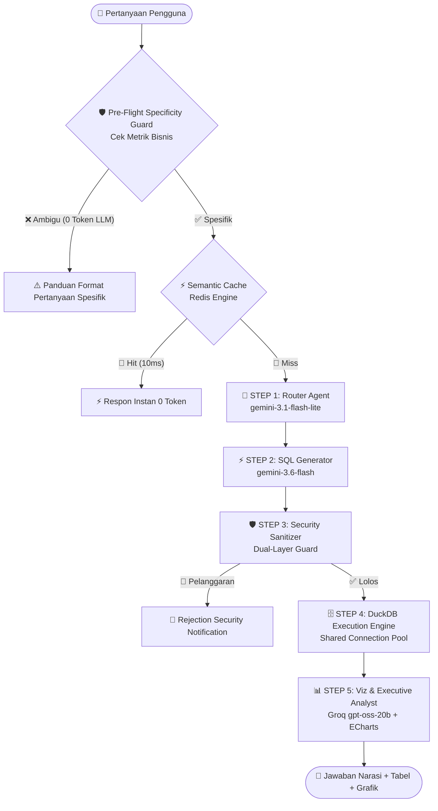

# 📘 Handover & Blueprint Sistem V3.0: TPS Enterprise AI Data Agent

**Tanggal Rilis:** September 2026  
**Versi Sistem:** 3.0 (Production-Ready & Highly Optimized)  
**Tujuan Dokumen:** Dokumen ini merupakan **Blueprint Arsitektur, Panduan Pengembang, dan Ground Truth Komprehensif** untuk memahami sistem AI Data Agent PT Terminal Petikemas Surabaya (TPS). Seluruh isi dokumen ini mencerminkan struktur implementasi kode terkini tanpa halusinasi.

---

## 🎯 1. Gambaran Umum Sistem (Executive Summary)

Aplikasi ini adalah **Enterprise AI Data Agent** yang dirancang khusus untuk menganalisis data finansial, logistik pelabuhan, operasional kapal, dan arus petikemas **PT Terminal Petikemas Surabaya (TPS)**.

Sistem bekerja dengan mengorkestrasi pipeline multi-agen mandiri:
1. **Natural Language ke SQL:** Mengubah pertanyaan bisnis bahasa manusia menjadi kueri analitik database murni (**DuckDB SQL**).
2. **High-Performance In-Process OLAP:** Menjalankan kueri dalam hitungan milidetik secara lokal tanpa risiko *data breach* ke pihak ketiga.
3. **Executive Narrative & Interactive Visualization:** Mengubah angka mentah database menjadi narasi bisnis berstandar direksi dan grafik interaktif (**Apache ECharts**).

---

## 🏗️ 2. Tumpukan Teknologi (Tech Stack)

### A. Backend Layer
- **Framework:** `FastAPI` (Python 3.11+)
- **Analytical Database (OLAP):** `DuckDB` (`data/processed/tps_komersial.duckdb` via Shared Connection Pool di `backend/db.py`)
- **In-Memory Cache & Session:** `Redis` (Shared Schema Cache, Semantic Response Cache, dan Multi-Session History Buffer)
- **Persistent Storage:** Dual-Layer JSON File Storage (`data/sessions/user_<username>.json`)
- **Authentication & Security:** JWT (RFC 7519), PBKDF2 Password Hashing dengan Salt unik, dan Dual-Layer Sanitizer

### B. AI & Multi-Agent Layer (LangGraph)
- **Orkestrator:** `LangGraph` (Linear Fail-Fast State Machine)
- **STEP 1 (Router):** Google Gemini (`gemini-3.1-flash-lite` / `gemini-2.5-flash-lite`)
- **STEP 2 (SQL Gen):** Google Gemini (`gemini-3.6-flash` / `gemini-3.1-pro`)
- **STEP 5 (Viz & Narrative):** Groq Cloud (`openai/gpt-oss-20b` / `llama-3.3-70b-versatile`)

### C. Frontend Layer
- **Framework:** `Vue 3` (Composition API) + `Vite`
- **Styling:** `Tailwind CSS` (Glassmorphism & Dark Mode Theme)
- **Interactive Charting:** `Apache ECharts` (via `vue-echarts`)

---

## 🤖 3. Alur Kerja Multi-Agent End-to-End (STEP 1 s/d STEP 5)

---

### 🛡️ Pre-Flight Specificity Guard (`backend/main.py`)
* **Lokasi:** `backend/main.py` (Langkah ke-2 setelah rate limiting, sebelum menyentuh LLM).
* **Fungsi:** Memfilter kueri ambigu/kurang spesifik (misal: *"berapa total tahun 2025"* atau *"kalau 2024"*).
* **Mekanisme:** Mengecek keberadaan kata kunci metrik bisnis resmi (*throughput, revenue, teus, box, market share, vessel/kapal, uncontainerized, restitusi, dll.*).
* **Efisiensi:** Jika ambigu, langsung ditolak dalam **0 ms dan 0 Token LLM (100% Gratis)** dengan memberikan contoh pertanyaan yang benar.

---

### 🧭 STEP 1: Semantic Routing & RBAC Filtering (`router.py`)
* **File:** `backend/agents/router.py`
* **Model AI:** Google Gemini `gemini-3.1-flash-lite`
* **Fungsi:** 
  1. Menganalisis pertanyaan bisnis pengguna dan mencocokkannya dengan **Katalog 9 Tabel DuckDB** yang telah diperkaya deskripsi semantik.
  2. Menerapkan RBAC (*Role-Based Access Control*) sesuai profil pengguna (*Executive*, *Commercial*, *Operation*, *Guest*).
* **Optimasi Token:** **Schema Pruning** — Hanya meloloskan 1–2 tabel relevan ke Step 2, memangkas 80% skema yang tidak terpakai dari prompt SQL Generator.

---

### ⚡ STEP 2: Text-to-SQL Generation (`sql_gen.py`)
* **File:** `backend/agents/sql_gen.py`
* **Model AI:** Google Gemini `gemini-3.6-flash`
* **Fungsi:**
  1. Merakit sintaks query DuckDB SQL murni yang valid.
  2. Menerapkan **Glosarium Domain PT TPS**:
     - *Throughput Petikemas* ➔ Kategori `'INTERNATIONAL'` atau `'DOMESTIC'`. (Tidak memfilter kata redundant 'peti kemas' / 'container').
     - *Pendapatan Pelanggan* ➔ Wajib menggabungkan `COALESCE(total_all_revenue, total_revenue) AS total_revenue`.
     - *Pencarian String* ➔ Wajib menggunakan operator case-insensitive `ILIKE`.
* **Optimasi Token:** **SQL-Only History** — Prompt obrolan lanjutan hanya menyertakan kueri SQL sebelumnya (menghapus narasi panjang 1.000 kata untuk menghemat token hingga 75%).

---

### 🛡️ STEP 3: Dual-Layer Security Sanitizer (`sanitizer.py`)
* **File:** `backend/agents/sanitizer.py`
* **Engine:** *Python-Native Rule Engine (0 Token LLM / <1ms Latency)*.
* **Fungsi:**
  1. **Input Guard:** Memeriksa pertanyaan pengguna dari percobaan SQL Injection, multiple statements (`;`), komentar SQL (`--`, `/* */`), dan kata kunci berbahaya (`DROP`, `DELETE`, `UPDATE`, `INSERT`, `TRUNCATE`, `ALTER`).
  2. **Output Guard:** Memverifikasi bahwa seluruh tabel dan alias CTE (`WITH ... AS`) pada SQL hasil rakitan LLM benar-benar valid di database DuckDB.
* **Output:** Jika aman, kueri diteruskan ke Step 4. Jika melanggar, eksekusi DuckDB dibatalkan seketika (*Fail-Safe*) dan dialihkan ke Step 5 untuk graceful rejection.

---

### 🗄️ STEP 4: High-Performance DuckDB Execution Engine (`execute.py`)
* **File:** `backend/agents/execute.py` & `backend/db.py`
* **Engine:** DuckDB Shared Connection Pool.
* **Fungsi:**
  1. Mengeksekusi SQL query langsung ke file `data/processed/tps_komersial.duckdb`.
  2. **Sanitasi Numerik:** Mengonversi nilai numerik `NaN` / `Infinity` menjadi `null` standar JSON agar kompatibel dengan browser.
  3. **Fail-Fast Empty Detection:** Jika kueri menghasilkan 0 baris atau nilai all-null, langsung menandai status `DATA_EMPTY` dan mengalirkan status ke Step 5 tanpa perulangan (*no retry loop*).

---

### 📊 STEP 5: Executive Business Narrative & Chart Generation (`viz_gen.py`)
* **File:** `backend/agents/viz_gen.py` & `backend/agents/chart_gen.py`
* **Model AI:** Groq Cloud `openai/gpt-oss-20b`
* **Fungsi:**
  1. **Executive Narrative:** Merangkum data angka menjadi narasi bisnis berstruktur rapi, satuan standar pelabuhan (*TEUs*, *Boxes*, *Rp* berpemisah titik ribuan, penomoran resmi `1. `, `2. `).
  2. **Smart Data Row Sampling:** Mengirimkan **maksimal 15 baris sampel teratas + total hitungan baris** ke LLM untuk membuat narasi (hemat token ~80%).
  3. **On-Demand Visualisasi:** Otomatis menghasilkan grafik Apache ECharts interaktif (Bar, Line, Donut) jika pengguna meminta grafik/tren.
  4. **Graceful Degradation:** Jika data kosong (`DATA_EMPTY`), memberikan saran panduan ramah tentang cara memperjelas pencarian.

---

## ⚡ 4. Ringkasan Pembaruan V3.0 (Evolution Highlights)

| Komponen | Implementasi V2.0 / V3.0 | Dampak Nyata |
| :--- | :--- | :--- |
| **🛡️ Pre-Flight Specificity Guard** | Validasi awal metrik di `backend/main.py`. | Menghilangkan halusinasi pada kueri ambigu; **0 Token LLM** dan latensi <2ms. |
| **🚫 Penghapusan Self-Healing** | Mengganti *looping retry* dengan *Fail-Fast Mechanism*. | Memangkas latensi dari 10s menjadi **~0.5 - 1.2s**; hemat token drastis. |
| **🪟 3-Turn Sliding Window** | Membatasi memori ke **3 percakapan terakhir** (`[-6:]`). | Mencegah pembengkakan token konteks pada obrolan panjang. |
| **🔐 Dual-Layer Session Storage** | Sinkronisasi Redis RAM + Disk JSON (`data/sessions/`). | Sesi tetap utuh saat komputer mati/restart (*Zero Data Loss*). |
| **🎛️ Per-Step API Key Management** | Alokasi kunci API mandiri untuk Step 1, Step 2, dan Step 5. | Rotasi multi-kunci otomatis, isolasi kuota, dan *Smart Unmasking*. |
| **🧹 Standarisasi `.gitignore`** | Pengecualian presisi untuk file data, DuckDB, session, & secrets. | Repositori bersih, aman dari kebocoran kredensial ke GitHub. |

---

## 🗄️ 5. Katalog 9 Tabel Database DuckDB (`tps_komersial.duckdb`)

1. **`fakta_throughput`:** Realisasi (`actual`), target (`budget`), dan variansi throughput petikemas (kategori: `INTERNATIONAL` / `DOMESTIC`).
2. **`fakta_komersial_dashboard`:** Pendapatan (`total_revenue`, `total_all_revenue`), total box, dan total TEUs per pelanggan/operator (`lop`).
3. **`fakta_market_share`:** Pangsa pasar, persentase, dan volume TEUs per operator pelayaran.
4. **`fakta_realisasi_uc`:** Realisasi kargo Uncontainerized (UC), volume, dan pendapatan per aktivitas (`Export` / `Import`).
5. **`fakta_rest_n_disc`:** Permohonan restitusi, diskon, dan keringanan biaya pelanggan (`nama_perusahaan`, `status`, `nominal_persetujuan_keringanan`).
6. **`fakta_vessel`:** Data operasional kapal, BCH, BSH, box, dan TEUs per operator kapal.
7. **`fakta_vessel_service`:** Rute pelayaran, service mode, total call kapal, BMPH, GMPH per operator pelayaran.
8. **`fakta_transhipment`:** Aktivitas transhipment kontainer (20ft, 40ft, 45ft), vessel revenue, dan yard revenue.
9. **`fakta_overview_box`:** Ringkasan jumlah box dan TEUs per kategori layanan.

---

## 🧪 6. Hasil Validasi Benchmark & Unit Test

- **Uji 1 (Top 5 LOP Revenue 2024):** CMA (Rp430,3 Miliar), SSL (Rp383,8 Miliar), MSK (Rp336,5 Miliar), MSC (Rp237,7 Miliar), EMC (Rp220,0 Miliar) ✅
- **Uji 2 (Throughput Internasional 2023 vs 2024):** 1.375.929 TEUs (2023) ➔ 1.407.258 TEUs (2024), Kenaikan +2,28% ✅
- **Uji 3 (UC Import vs Export 2024):** Import Rp1,68 Triliun (12.899 TEUs) vs Export Rp222,4 Miliar (3.250 TEUs) ✅
- **Uji 4 (Market Share TEUs 2024):** SSL (922.712 TEUs), MSK (887.620 TEUs), EMC (830.337 TEUs) ✅
- **Uji 5 (Restitusi Disetujui):** PT Antam (Rp65 Juta), PT Paragon (Rp35 Juta), PT United Tractors (Rp10 Juta) ✅
- **Pytest Automated Tests:** 9 Unit Tests lulus 100% dalam **0.69 detik** (`9 passed in 0.69s`) ✅
