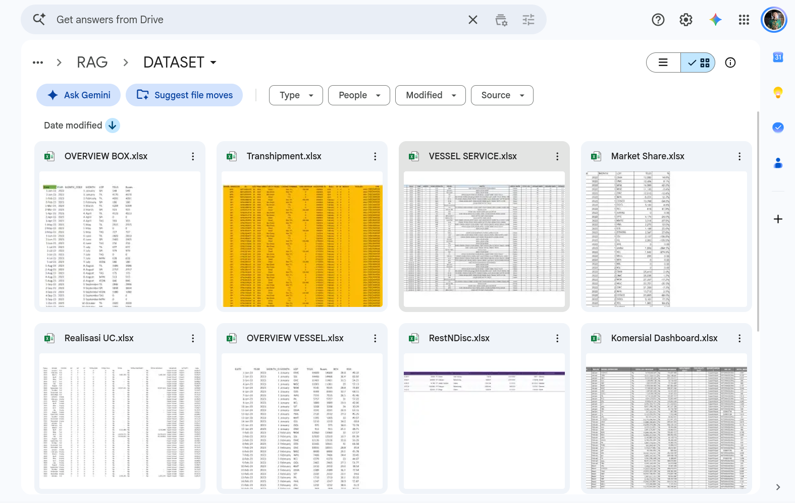
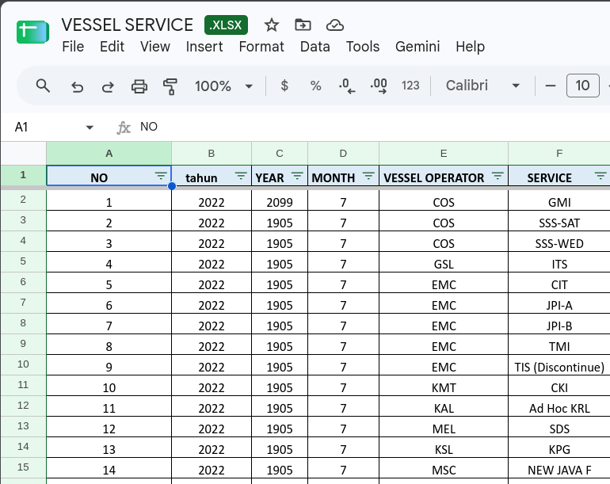
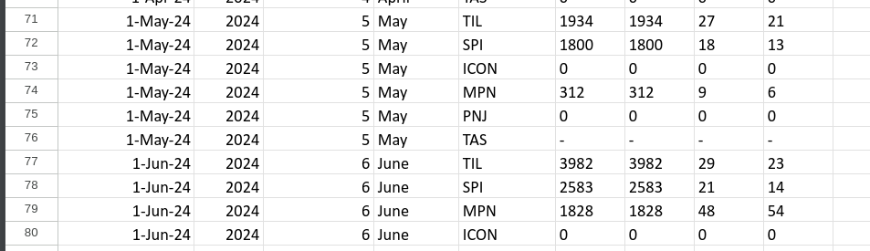
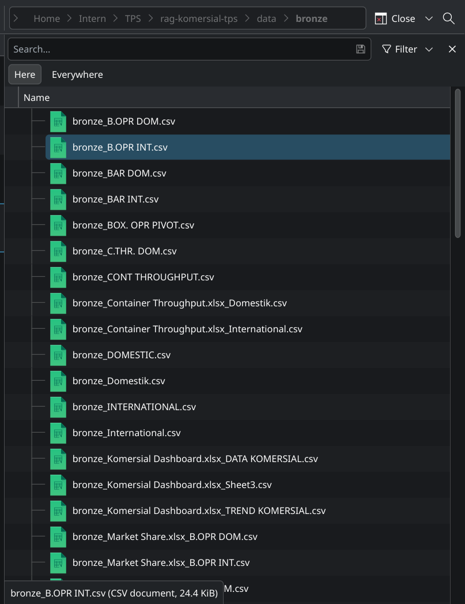
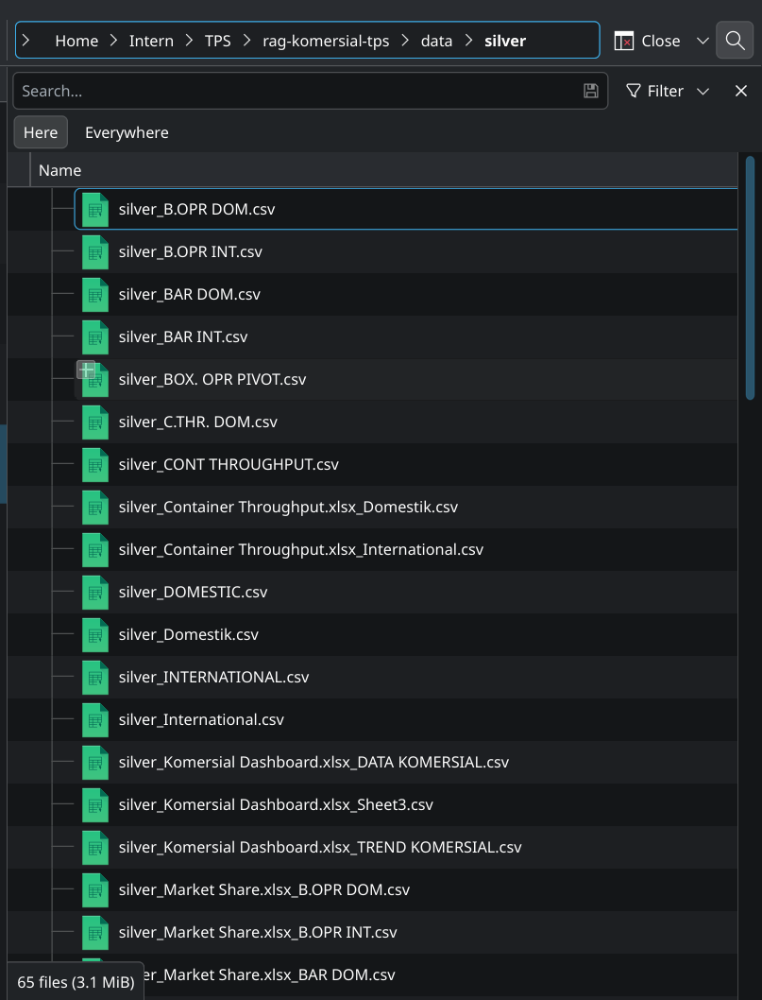
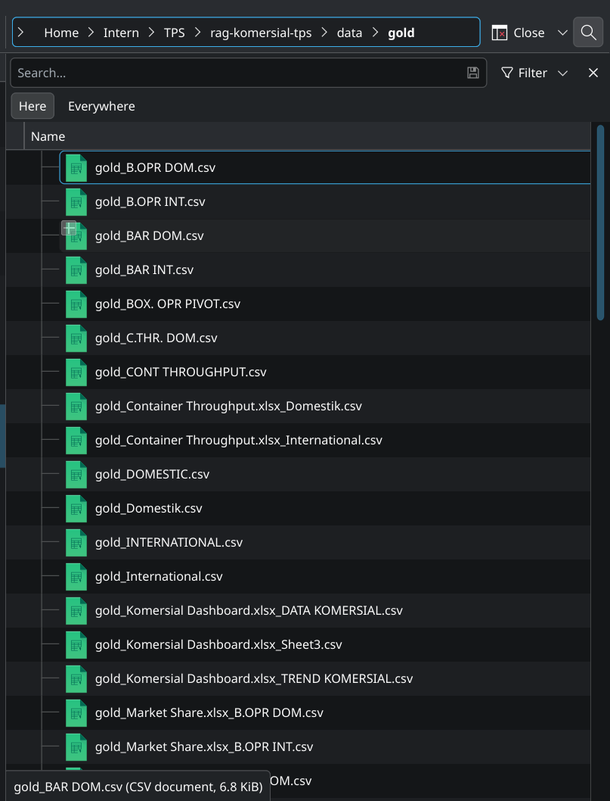

# DATA PIPELINE DOCUMENTATION

## Pemetaan Data Raw → Bronze → Silver → Gold → DuckDB

**Proyek:** Pengembangan Asisten Analitik Data Berbasis Multi-Agent Text-to-SQL dan Medallion Architecture pada Perusahaan Layanan Petikemas: Studi Kasus PT XYZ  
**Status:** Master Documentation / Living Document  
**Tujuan:** Dokumentasi teknis dan akademik proses pengolahan data dari data mentah hingga data siap analitik.  
**Penulis:** Nabiel Nizar Anwari (NRP: 5027231087) — Teknologi Informasi, Institut Teknologi Sepuluh Nopember  
**Tanggal Audit & Rilis:** 14 September 2026

---

# 1. Tujuan Dokumentasi

Dokumentasi ini dibuat untuk menjelaskan secara terstruktur perjalanan data dari sumber mentah (_raw data_) hingga menjadi data matang (_Gold layer_) yang dimaterialisasikan ke dalam _in-process OLAP database_ DuckDB dan digunakan sebagai sumber analitik bagi sistem Multi-Agent Text-to-SQL.

Dokumentasi ini menjawab 9 pertanyaan utama:

1. **Dari mana data berasal?** Berasal dari 9 file spreadsheet kerja Microsoft Excel (`.xlsx`) yang dikelola oleh Divisi Komersial PT XYZ (Terminal Petikemas Surabaya).
2. **Bagaimana karakteristik data mentah?** Berformat tabular heterogen (non-3NF), sebagian berformat transaksional, sebagian laporan horizontal (_wide pivot_), memuat formula Excel yang korup, serta menyatukan data transaksi dan kamus master dalam satu lembar kerja.
3. **Apa yang terjadi pada data pada setiap layer Medallion?**
   - **Bronze:** Pembacaan utuh lembar demi lembar tanpa alterasi nilai ke in-memory dataframe dan checkpoint CSV.
   - **Silver:** Pembersihan teknis (pembuangan kolom _Unnamed_, pemangkasan spasi, pemaksaan nilai numerik, penggantian dash `"-"` menjadi 0, dan pemulihan tahun formula rusak).
   - **Gold:** Restrukturisasi bentuk data (Unpivot format wide ke long), filtering rentang tahun valid operasional (2020–2030), penyeragaman snake_case, dan penambahan tagging metadata.
4. **Transformasi apa saja yang dilakukan?** Unpivot (_pd.melt_), sanitasi skema awal (drop kolom artefak format _Unnamed_ & trimming spasi), renaming simbolik (`%` $\rightarrow$ `persentase`), standarisasi operator (`LOP`), type coercion numerik, pemulihan tahun formula korup, standardisasi lowercase snake_case, konsolidasi multi-sheet vertikal, ekstraksi tabel dimensi, dan pemangkasan residu timestamp `' 00:00:00'`.
5. **Mengapa setiap transformasi diperlukan?** Untuk menjamin integritas skema data, menghemat token prompt LLM hingga >60%, mencegah halusinasi query SQL, serta memastikan eksekusi agregasi DuckDB berjalan deterministik tanpa error tipe data.
6. **Seperti apa bentuk data sebelum dan sesudah transformasi?** Disajikan secara konkret pada Bagian 9 dan Bagian 10 melalui perbandingan data riil per baris dari file checkpoint CSV aktual.
7. **Bagaimana data Gold dimaterialisasikan ke DuckDB?** Melalui `pd.concat()` antar-sheet setipe, eksekusi DDL `CREATE OR REPLACE TABLE`, pasca-proses ekstraksi dimensi master, pembersihan residu waktu, dan type casting diskrit ke `BIGINT`.
8. **Bagaimana data tersebut digunakan oleh asisten analitik?** Digunakan oleh arsitektur Multi-Agent (Router berbasis RBAC, Schema Pruning pada SQL Generator, Execution Engine via Connection Pool DuckDB, dan Visualization Generator).
9. **Informasi apa yang berpotensi sensitif dan bagaimana status penanganannya?** Ditemukan nama klien korporat, nominal rupiah restitusi/diskon riil, nomor surat jawaban resmi, tautan Google Drive nota internal, serta pendapatan miliaran rupiah. Status saat ini: menunggu konfirmasi batas masking resmi dari dosen pembimbing/instansi.

---

# 2. Lingkup Dokumentasi

Dokumentasi mencakup:

- Data mentah (_Raw_)
- Bronze Layer
- Silver Layer
- Gold Layer
- Materialisasi dan penyimpanan pada DuckDB
- Transformasi data yang benar-benar diimplementasikan
- Contoh Before–After berbasis file checkpoint riil
- Pemetaan tabel Gold/DuckDB
- Keterkaitan data dengan Multi-Agent Text-to-SQL
- Status kerahasiaan data
- Artefak dan bukti implementasi

Dokumentasi ini **tidak** mengklaim fitur, proses, atau transformasi yang tidak ditemukan pada implementasi aktual.

---

# 3. Ringkasan Arsitektur Data

## 3.1 Data Lineage

> **RAW → BRONZE → SILVER → GOLD → DUCKDB → MULTI-AGENT TEXT-TO-SQL**

```
+---------------------------------------------------------------------------------------------------+
| 1. RAW LAYER (Storage Fisik: data/raw/)                                                           |
| 9 File Excel Fisik (.xlsx) | Total Ukuran: ~2.99 MB | 48 Sheet Terbaca                            |
+-------------------------------------------------+-------------------------------------------------+
                                                  |
                                                  v [pd.read_excel(sheet_name=None)]
+---------------------------------------------------------------------------------------------------+
| 2. BRONZE LAYER (data/bronze/)                                                                    |
| Ekstraksi Lembar Kerja Apa Adanya ke In-Memory DataFrames + 65 Checkpoint CSV Mentah              |
+-------------------------------------------------+-------------------------------------------------+
                                                  |
                                                  v [sanitasi_skema_awal() + paksa_angka()]
+---------------------------------------------------------------------------------------------------+
| 3. SILVER LAYER (data/silver/)                                                                    |
| Pembersihan Teknis: Drop Unnamed, Trim Spasi, Standarisasi LOP, Replace '-' -> 0, Recovery Tahun  |
+-------------------------------------------------+-------------------------------------------------+
                                                  |
                                                  v [pd.melt() + Filter Tahun + Regex Snake_Case]
+---------------------------------------------------------------------------------------------------+
| 4. GOLD LAYER (data/gold/)                                                                        |
| Restrukturisasi Tidy Data: Unpivot Matriks Wide->Long, Normalisasi Kategori, Standardisasi Kolom |
+-------------------------------------------------+-------------------------------------------------+
                                                  |
                                                  v [pd.concat() + CREATE OR REPLACE + Post-Process]
+---------------------------------------------------------------------------------------------------+
| 5. DUCKDB STORAGE (data/processed/tps_komersial.duckdb)                                           |
| 10 Tabel Analitik Fisik (9 Fakta + 1 Dimensi) | Total Data: 32.264 Baris | Ukuran: 7.51 MB        |
+-------------------------------------------------+-------------------------------------------------+
                                                  |
                                                  v [Read-Only Connection Pool]
+---------------------------------------------------------------------------------------------------+
| 6. MULTI-AGENT TEXT-TO-SQL SYSTEM                                                                 |
| Router (RBAC Intent) -> SQL Gen (Pruning) -> DuckDB Exec (Deterministic) -> Viz Gen (Insight)     |
+---------------------------------------------------------------------------------------------------+
```

## 3.2 Ringkasan Setiap Layer

| Layer      | Input                                             | Proses Utama                                                                                                                                                      | Output                                                                           | Bukti Implementasi                                    |
| ---------- | ------------------------------------------------- | ----------------------------------------------------------------------------------------------------------------------------------------------------------------- | -------------------------------------------------------------------------------- | ----------------------------------------------------- |
| **Raw**    | File spreadsheet operasional dari unit komersial. | Pengarsipan file mentah apa adanya di direktori lokal.                                                                                                            | 9 File `.xlsx` (total ~2.99 MB, 48 sheet).                                       | Direktori `data/raw/`                                 |
| **Bronze** | 9 file Excel di `data/raw/`.                      | Ekstraksi otomatis per sheet dengan `pd.read_excel(..., sheet_name=None)`.                                                                                        | In-memory DataFrames + 65 file CSV mentah.                                       | `main_etl.py: L71-L81`, folder `data/bronze/`         |
| **Silver** | DataFrame Bronze per sheet.                       | Hapus kolom Unnamed, trimming string header, standarisasi nama LOP & %, replace dash `"-"` $\rightarrow$ 0, pemaksaan numerik (`pd.to_numeric`).                  | In-memory DataFrames bersih + 65 file CSV bersih.                                | `utils.py: L41-L93`, folder `data/silver/`            |
| **Gold**   | DataFrame Silver per sheet.                       | Unpivot (_melt_) sheet pivot horizontal, filter tahun operasional valid (`2020 <= year <= 2030`), snake_case regex, tagging metadata.                             | In-memory DataFrames terstandarisasi + 65 file CSV.                              | `transformers.py: L1-L203`, folder `data/gold/`       |
| **DuckDB** | Koleksi DataFrame Gold per kategori tabel.        | `pd.concat()`, penanaman tabel fisik (`CREATE OR REPLACE TABLE`), ekstraksi `dim_vessel_operator`, pemangkasan string `' 00:00:00'`, casting diskrit ke `BIGINT`. | 10 Tabel Basis Data OLAP (`tps_komersial.duckdb`, ukuran 7.51 MB, 32.264 baris). | `main_etl.py: L102-L250`, file `tps_komersial.duckdb` |

---

# 4. Audit Data Mentah (Raw Data)

## 4.1 Sumber Data Mentah



Berikut adalah inventarisasi seluruh sumber data mentah aktual yang terbaca oleh router ETL:

| No. | Sumber/File                 | Format        | Sheet/Tabel                                                                                                                                                                                                                                                                                                           | Lokasi      | Status Verifikasi |
| --: | --------------------------- | ------------- | --------------------------------------------------------------------------------------------------------------------------------------------------------------------------------------------------------------------------------------------------------------------------------------------------------------------- | ----------- | ----------------- |
|   1 | `Container Throughput.xlsx` | Excel (.xlsx) | 2 sheet (`Domestik`, `International`)                                                                                                                                                                                                                                                                                 | `data/raw/` | **VERIFIED**      |
|   2 | `Komersial Dashboard.xlsx`  | Excel (.xlsx) | 3 sheet (`DATA KOMERSIAL`, `TREND KOMERSIAL`, `Sheet3`)                                                                                                                                                                                                                                                               | `data/raw/` | **VERIFIED**      |
|   3 | `Market Share.xlsx`         | Excel (.xlsx) | 13 sheet (`SL INT`, `BOX. OPR PIVOT`, `CONT THROUGHPUT`, `C.THR. DOM`, `V.OPR INT`, `V.OPR DOM`, `B.OPR INT`, `B.OPR DOM`, `TOP SERVICES`, `SL DOM`, `Sheet12`, `BAR INT`, `BAR DOM`)                                                                                                                                 | `data/raw/` | **VERIFIED**      |
|   4 | `OVERVIEW BOX.xlsx`         | Excel (.xlsx) | 2 sheet (`DOMESTIK`, `INTERNATIONAL`)                                                                                                                                                                                                                                                                                 | `data/raw/` | **VERIFIED**      |
|   5 | `OVERVIEW VESSEL.xlsx`      | Excel (.xlsx) | 2 sheet (`DOMESTIC`, `INTERNATIONAL`)                                                                                                                                                                                                                                                                                 | `data/raw/` | **VERIFIED**      |
|   6 | `Realisasi UC.xlsx`         | Excel (.xlsx) | 3 sheet (`SUMMARY`, `TREND UC`, `OH OW OL`)                                                                                                                                                                                                                                                                           | `data/raw/` | **VERIFIED**      |
|   7 | `RestNDisc.xlsx`            | Excel (.xlsx) | 1 sheet (`Form Responses 1`)                                                                                                                                                                                                                                                                                          | `data/raw/` | **VERIFIED**      |
|   8 | `Transhipment.xlsx`         | Excel (.xlsx) | 18 sheet (`new vr`, `Transhipment `, `YR Disc Real New`, `YR Load Real`, `YR Load Cancel New`, `YR Load Cancel`, `YR Disc Cancel`, `YR Disc Real`, `VR`, `YR Disc Real 10%`, `YR Disc Real 50%`, `YR Disc Can 10%`, `YR Disc Can 50%`, `YR Load Real 10%`, `YR Load Real 50%`, `YR Load Can 50%`, `VR 10%`, `VR 50%`) | `data/raw/` | **VERIFIED**      |
|   9 | `VESSEL SERVICE.xlsx`       | Excel (.xlsx) | 4 sheet (`New`, `Sheet4`, `Pivot Table 1`, `Sheet3`)                                                                                                                                                                                                                                                                  | `data/raw/` | **VERIFIED**      |

## 4.2 Karakteristik Struktur Data Mentah

Berdasarkan pemeriksaan fisik baris demi baris, karakteristik data mentah meliputi:

1. **Heterogenitas Skema per File:** Setiap workbook memiliki konvensi penamaan yang berbeda bergantung pada staf penyusunnya (misal: singkatan operator ditulis LOP pada satu file, tetapi ditulis VESSEL OPERATOR pada file lain).
2. **Format Wide / Pivot Table:** Sheet `B.OPR INT` dan `B.OPR DOM` menyusun metrik TEUS tahun 2022 hingga 2026 secara horizontal pada kolom terpisah (`2022 (TEUS)`, `2023 (TEUS)`, dst.), bukan dalam struktur relasional terindeks waktu.
3. **Penyatuan Master Data ke Lembar Transaksi:** Sheet `Sheet3` pada `Komersial Dashboard.xlsx` berisi master pemetaan kode dan nama panjang 23 operator pelayaran yang disatukan dalam file pelaporan pendapatan.
4. **Karakter Pengganti Nol:** Sel kosong bernilai nol secara konsisten ditulis menggunakan karakter tanda hubung/dash `"-"`.
5. **Format Waktu Tanpa Jam:** Kolom penanda tanggal diformat sebagai tanggal murni (`d-mmm-yy`), namun saat dibaca oleh pustaka Python otomatis diterjemahkan sebagai timestamp dengan komponen jam `00:00:00`.

## 4.3 Permasalahan Data Mentah yang Terverifikasi




| No. | Permasalahan                                 | Contoh Aktual                                                                                                                                  | Dampak terhadap Pengolahan                                                                     | Bukti File/Code                                              |
| --: | -------------------------------------------- | ---------------------------------------------------------------------------------------------------------------------------------------------- | ---------------------------------------------------------------------------------------------- | ------------------------------------------------------------ |
|   1 | **Kolom Artefak Format (_Unnamed Columns_)** | `Unnamed: 4` pada `Market Share.xlsx` (sheet `C.THR. DOM`) dan `Transhipment.xlsx` (sheet `Transhipment `).                                    | Mengotori skema database dan membingungkan context window prompt LLM.                          | `data/raw/Market Share.xlsx`, `utils.py: L41-L69`            |
|   2 | **Inkonsistensi Nomenklatur Header**         | `'VESSEL OPERATOR'` vs `'OPERATOR'` vs `'LOP'`.                                                                                                | Gagal melakukan agregasi atau join antar-tabel jika nama kolom tidak seragam.                  | `transformers.py: L59, L92, L111`                            |
|   3 | **Typo Header Parah**                        | `'MONT H'` (ada spasi di tengah kata) pada `OVERVIEW BOX.xlsx` sheet `INTERNATIONAL`.                                                          | Memecah kolom bulan menjadi dua kolom terpisah di database (`month` dan `mont_h`).             | `data/raw/OVERVIEW BOX.xlsx`, `transformers.py: L178`        |
|   4 | **Trailing Whitespace Kolom**                | Header `'TEUS '` (dengan spasi di akhir kata).                                                                                                 | Query SQL persis (`SELECT TEUS`) akan gagal karena terdaftar sebagai `TEUS `.                  | `utils.py: L47`                                              |
|   5 | **Karakter Dash sebagai Nol**                | Kolom `TEUS = "-"` pada `OVERVIEW VESSEL.xlsx` baris 142.                                                                                      | Tipe data kolom tertahan sebagai string/object, menggagalkan operasi matematis SUM/AVG.        | `utils.py: L73`                                              |
|   6 | **Formula Tahun Korup**                      | Formula `=YEAR()` menghasilkan nilai `1905` dan `2099` pada 159 baris di `VESSEL SERVICE.xlsx`.                                                | Data historis menjadi tidak valid dan terbuang saat difilter berdasarkan tahun.                | `data/raw/VESSEL SERVICE.xlsx`, `transformers.py: L113-L120` |
|   7 | **Human Error Salin-Tempel**                 | `OVERVIEW BOX.xlsx` sheet `INTERNATIONAL` terpotong 517 baris dengan tanggal yang tertukar akibat salinan parsial dari `OVERVIEW VESSEL.xlsx`. | Terbuangnya 308 baris data internasional dan hilangnya informasi throughput ratusan ribu TEUs. | `transformers.py: L170-L190`, `main_etl.py: L195-L213`       |

---

# 5. Pemetaan RAW → BRONZE

## 5.1 Input

9 file fisik spreadsheet `.xlsx` yang terletak di folder `data/raw/`.

## 5.2 Proses

Proses ingest dieksekusi secara terprogram menggunakan pustaka Pandas dan OpenPyXL:

```python
semua_sheet = pd.read_excel(path_file, sheet_name=None)
```

Argumen `sheet_name=None` memastikan seluruh lembar kerja di dalam berkas Excel diekstraksi tanpa ada yang terlewat menjadi sebuah dictionary Python `{nama_sheet: DataFrame_mentah}`.

## 5.3 Perlakuan terhadap Data

Pada layer Bronze, **data dipertahankan 100% apa adanya sesuai kondisi mentah**. Tidak ada penghapusan baris, pengubahan tipe data, maupun pemotongan spasi. Jika konfigurasi `DEBUG_MODE = True` aktif, dataframe mentah langsung ditulis ke format file CSV sebagai bukti audit fisik.

## 5.4 Output


- **In-Memory:** Dictionary of DataFrames mentah per file.
- **Artefak Fisik Checkpoint:** 65 file CSV di folder `data/bronze/` dengan pola nama `bronze_{nama_file}_{nama_sheet}.csv`.

## 5.5 Bukti Implementasi

| Komponen           | Bukti                                                                                                |
| ------------------ | ---------------------------------------------------------------------------------------------------- |
| **Script / File**  | [backend/etl/main_etl.py](../backend/etl/main_etl.py) |
| **Function**       | `jalankan_etl()` (baris 71–81)                                                                       |
| **Artefak Output** | Direktori `data/bronze/` (65 file CSV, contoh: `bronze_Container Throughput.xlsx_Domestik.csv`)      |

---

# 6. Pemetaan BRONZE → SILVER

## 6.1 Input

Objek DataFrame mentah per sheet yang dihasilkan dari layer Bronze.

## 6.2 Transformasi

Pada layer Silver, dilakukan standardisasi teknis dan sanitasi integritas tipe data:

| No. | Transformasi                                      | Before                                | After                                         | Alasan                                                                        | Bukti Code                        |
| --: | ------------------------------------------------- | ------------------------------------- | --------------------------------------------- | ----------------------------------------------------------------------------- | --------------------------------- |
|   1 | **Sanitasi Skema Awal & Eliminasi Kolom Artefak** | Kolom `Unnamed: 4` & spasi nama kolom | Dihapus / di-trim via `sanitasi_skema_awal()` | Menghilangkan artefak kosong Excel dan spasi liar yang mengotori skema tabel. | `utils.py: L41-L69`               |
|   2 | **Trimming Spasi Header**                         | Header string `'TEUS '`               | Header string `'TEUS'`                        | Mencegah kegagalan parsing nama kolom saat diakses via SQL.                   | `utils.py: L47`                   |
|   3 | **Penyeragaman Simbol Persen**                    | Header string `'%'`                   | Header string `'persentase'`                  | Simbol `%` merupakan reserved character di SQL / regex.                       | `utils.py: L50`                   |
|   4 | **Diferensiasi Semantik Kolom TEUS**              | Kolom `TEUS` setelah `BOXES`          | `boxes_teus`                                  | Menghilangkan ambiguitas nama kolom duplikat bagi LLM.                        | `utils.py: L58-L60`               |
|   5 | **Diferensiasi Semantik Kolom TEUS**              | Kolom `TEUS` setelah `MOVES`          | `moves_teus`                                  | Menghilangkan ambiguitas metrik pergerakan crane vs kapasitas peti kemas.     | `utils.py: L61-L63`               |
|   6 | **Standarisasi Operator Pelayaran**               | `'VESSEL OPERATOR'` / `'OPERATOR'`    | `'LOP'`                                       | Menyeragamkan identitas entitas bisnis di seluruh tabel fakta.                | `transformers.py: L59, L92, L111` |
|   7 | **Sanitasi Dash Nol**                             | Nilai string `"-"`                    | Nilai numerik `0`                             | Memungkinkan kolom diagregasi secara matematis.                               | `utils.py: L73`                   |
|   8 | **Type Coercion Numerik**                         | String berformat `"1,500"`            | Numerik `1500.0` (float)                      | Mengubah teks angka menjadi tipe data numerik nyata.                          | `utils.py: L77-L92`               |
|   9 | **Pemulihan Tahun Rusak Formula**                 | `YEAR = 2099` atau `1905`             | `YEAR = 2022`                                 | Memulihkan tahun operasional yang salah akibat formula `=YEAR()`.             | `transformers.py: L113-L120`      |

## 6.3 Output





- **In-Memory:** Objek `df_silver` (DataFrame bersih terstandarisasi).
- **Artefak Fisik Checkpoint:** 65 file CSV di folder `data/silver/` dengan pola nama `silver_{nama_file}_{nama_sheet}.csv`.

---

# 7. Pemetaan SILVER → GOLD

## 7.1 Input

Objek `df_silver` yang telah melalui standardisasi teknis pada layer Silver.

## 7.2 Transformasi

Pada layer Gold, dilakukan pemodelan bisnis, perataan struktur (_unpivot_), dan penyeragaman skema database OLAP:

| No. | Transformasi                          | Before                                                                    | After                                               | Alasan                                                                                     | Bukti Code                                                          |
| --: | ------------------------------------- | ------------------------------------------------------------------------- | --------------------------------------------------- | ------------------------------------------------------------------------------------------ | ------------------------------------------------------------------- |
|   1 | **Unpivot (Melt) Matriks Horizontal** | 4 kolom terpisah: `'2022 (TEUS)'`, `'2023 (TEUS)'`, `'2024 (TEUS)'`, dst. | 2 kolom vertikal: `tahun_kategori` dan `total_teus` | Mengubah bentuk wide menjadi long (_tidy data_) agar efisien diagregasikan oleh query SQL. | `transformers.py: L68-L76`                                          |
|   2 | **Penyaringan Rentang Tahun Valid**   | Baris data tahun di luar rentang (misal baris formula kosong 0.0)         | Hanya baris dengan `2020 <= YEAR <= 2030`           | Membuang baris rekapitulasi kosong di bagian bawah lembar kerja Excel.                     | `transformers.py: L96-L97, L125-L129, L184-L185`                    |
|   3 | **Standarisasi Kategori Layanan**     | Nilai `'Domestik'` / `'DOMESTIK'`                                         | Nilai `'DOMESTIC'`                                  | Standarisasi terminologi bahasa Inggris pada data warehouse.                               | `transformers.py: L8-L16`                                           |
|   4 | **Tagging Metadata Asal**             | Tidak ada kolom penanda asal sheet                                        | Kolom `sumber_sheet` terisi nama sheet asal         | Menjaga lineage dan keterlacakan audit data asal setelah digabung.                         | `transformers.py: L78, L98, L131, L148, L164, L200`                 |
|   5 | **Standardisasi Kolom ke Snake_Case** | `'TOTAL ALL REVENUE'`, `'REPAYMENT (DAY)'`                                | `total_all_revenue`, `repayment_day`                | Menjamin kompatibilitas penulisan query ANSI SQL bebas tanda kutip.                        | `transformers.py: L30, L47, L79, L99, L132, L149, L165, L187, L201` |
|   6 | **Pencegahan Nama Kolom Duplikat**    | Kolom ganda bernama sama akibat concat                                    | Kolom unik berakhiran `_1`, `_2`                    | Mencegah exception `Reindexing only valid with uniquely valued Index objects`.             | `utils.py: L94-L104`                                                |

## 7.3 Output

- **In-Memory:** Objek `df_gold` dan string penanda `nama_tabel` target.
- **Artefak Fisik Checkpoint:** 65 file CSV di folder `data/gold/` dengan pola nama `gold_{nama_file}_{nama_sheet}.csv`.

---

# 8. Pemetaan GOLD → DUCKDB

## 8.1 Konsolidasi Data

Setelah setiap sheet selesai diproses pada layer Gold, seluruh dataframe yang mengarah ke target tabel fakta yang sama dikonsolidasikan secara vertikal:

```python
df_final = pd.concat(daftar_df, ignore_index=True)
```

Sebelum disimpan ke DuckDB, seluruh kolom waktu diformat ke format tanggal standar ISO:

```python
for col in df_final.select_dtypes(include=['datetime', 'datetimetz']).columns:
    df_final[col] = df_final[col].dt.strftime('%Y-%m-%d')
```

Residu string `' 00:00:00'` pada tipe string/object secara otomatis dipangkas.

## 8.2 Pembuatan Tabel DuckDB

Tabel fisik dimaterialisasikan ke DuckDB menggunakan mekanisme registrasi tabel virtual:

```python
conn.register('temp_df', df_final)
conn.execute(f"CREATE OR REPLACE TABLE {nama_tabel} AS SELECT * FROM temp_df")
conn.unregister('temp_df')
```

File basis data tersimpan secara permanen di path: `data/processed/tps_komersial.duckdb`. Sistem analitik mengakses database ini melalui _Connection Pool Read-Only_ ([backend/db.py](../backend/db.py)) untuk mencegah konflik penguncian berkas (_file lock_).

## 8.3 Post-Processing DuckDB

| No. | Post-Processing                                  | Tujuan                                                                                                                                           | Bukti Code               |
| --: | ------------------------------------------------ | ------------------------------------------------------------------------------------------------------------------------------------------------ | ------------------------ |
|   1 | **Ekstraksi Kamus Master `dim_vessel_operator`** | Memisahkan data master dari sheet `SHEET3` pada `fakta_komersial_dashboard` ke dalam tabel dimensi master terdedikasi (23 baris).                | `main_etl.py: L147-L154` |
|   2 | **Enrichment Nama Lengkap Operator**             | Melakukan query `UPDATE ... SET full_name = d.full_name, code = d.code FROM dim_vessel_operator` pada `fakta_komersial_dashboard`.               | `main_etl.py: L158-L165` |
|   3 | **Penyelarasan `fakta_overview_box`**            | Mengisi tabel `fakta_overview_box` langsung dari master data valid `fakta_vessel` (940 baris) guna menggantikan salinan mentah Excel yang rusak. | `main_etl.py: L196-L213` |
|   4 | **Pembersihan Residu Timestamp SQL**             | Menjalankan query `UPDATE ... SET date = REPLACE(date, ' 00:00:00', '')` pada 6 tabel fakta terkait.                                             | `main_etl.py: L216-L228` |
|   5 | **Type Casting Diskrit ke BIGINT**               | Mengonversi kolom bilangan bulat diskrit (`year`, `month`, `total_box`, `moves`, `boxes`) dari `DOUBLE` menjadi `BIGINT` murni.                  | `main_etl.py: L231-L249` |

---

# 9. Katalog Transformasi Data Terverifikasi

| ID      | Transformasi             | Layer  | File / Sheet Sumber                   | Before                             | After                                | Dampak Analitik                                       | Code Reference                 | Verification |
| ------- | ------------------------ | :----: | ------------------------------------- | ---------------------------------- | ------------------------------------ | ----------------------------------------------------- | ------------------------------ | :----------: |
| **T01** | Eliminasi Unnamed        | Silver | `Market Share.xlsx` (`C.THR. DOM`)    | Kolom `Unnamed: 4`                 | Kolom di-drop                        | Skema bersih dari artefak kosong Excel                | `utils.py: L65-L67`            | **VERIFIED** |
| **T02** | Trimming Header Spasi    | Silver | `OVERVIEW VESSEL.xlsx`                | Header `'TEUS '`                   | Header `'TEUS'`                      | Query SQL `SELECT teus` berhasil dieksekusi           | `utils.py: L47`                | **VERIFIED** |
| **T03** | Penyeragaman Simbol %    | Silver | `Market Share.xlsx` (`SL INT`)        | Kolom `'%'`                        | Kolom `'persentase'`                 | Menghilangkan error sintaks SQL pada kolom simbolik   | `utils.py: L50`                | **VERIFIED** |
| **T04** | Standarisasi Operator    | Silver | `VESSEL SERVICE.xlsx` (`New`)         | Header `'VESSEL OPERATOR'`         | Header `'LOP'`                       | Konsistensi relasi entitas pelayaran di seluruh tabel | `transformers.py: L111`        | **VERIFIED** |
| **T05** | Sanitasi Dash Nol        | Silver | `OVERVIEW VESSEL.xlsx` (`DOMESTIC`)   | Sel bernilai `"-"`                 | Sel bernilai `0`                     | Memungkinkan kolom diagregasikan oleh fungsi SUM      | `utils.py: L73`                | **VERIFIED** |
| **T06** | Pemulihan Tahun Rusak    | Silver | `VESSEL SERVICE.xlsx` (`New`)         | `YEAR = 2099` / `1905` (159 baris) | `YEAR = 2022`                        | Menyelamatkan data historis kapal agar tidak terbuang | `transformers.py: L113-L120`   | **VERIFIED** |
| **T07** | Unpivot Matriks Wide     |  Gold  | `Market Share.xlsx` (`B.OPR INT`)     | 10 kolom wide (587 baris)          | 8 kolom long (2.935 baris)           | Memungkinkan filter dan tren tahunan berbasis SQL     | `transformers.py: L68-L76`     | **VERIFIED** |
| **T08** | Filter Rentang Tahun     |  Gold  | `Transhipment.xlsx`                   | Nilai tahun kosong / < 2020        | Hanya baris `2020 <= year <= 2030`   | Menghilangkan baris ringkasan/formula kosong Excel    | `transformers.py: L96-L97`     | **VERIFIED** |
| **T09** | Konversi Snake_Case      |  Gold  | Seluruh Sheet                         | `'TOTAL ALL REVENUE'`              | `total_all_revenue`                  | Penulisan query SQL bebas tanda kutip ganda           | `transformers.py: L149`        | **VERIFIED** |
| **T10** | Pemisahan Master Dimensi | DuckDB | `Komersial Dashboard.xlsx` (`Sheet3`) | Bercampur di tabel fakta           | Tabel terpisah `dim_vessel_operator` | Membentuk Star Schema OLAP yang terstandarisasi       | `main_etl.py: L147-L154`       | **VERIFIED** |
| **T11** | Sanitasi Tanggal ISO     | DuckDB | `fakta_vessel`, `fakta_overview_box`  | `"2023-01-01 00:00:00"`            | `"2023-01-01"`                       | Tanggal bersih tanpa membingungkan adanya data jam    | `main_etl.py: L110-L116, L225` | **VERIFIED** |
| **T12** | Casting Diskrit BIGINT   | DuckDB | Seluruh Tabel Fakta                   | Tipe data `DOUBLE` (`1500.0`)      | Tipe data `BIGINT` (`1500`)          | Menjamin integritas tipe data cacah/kuantitas boks    | `main_etl.py: L231-L249`       | **VERIFIED** |

## 9.1 Contoh 1 — Transformasi Paling Representatif (Kasus Unpivot Sheet B.OPR INT)

Kasus transformasi paling representatif adalah proses **Unpivot Matriks Pangsa Pasar Operator** pada file `Market Share.xlsx` sheet `B.OPR INT`.

### Before (Kondisi Raw / Bronze)

Struktur berformat laporan horizontal (_wide format_), di mana metrik TEUS per tahun disusun melebar ke samping sebagai kolom independen:

```text
Shape: 587 baris x 10 kolom
Kolom: ['DATE', 'YEAR', 'MONTH', 'LOP', '2022 (TEUS)', '2023 (TEUS)', '2024 (TEUS)', '2025 (TEUS)', '2026 (TEUS)', '%']

Contoh Baris 0:
DATE       : 2024-01-01
YEAR       : 2024
MONTH      : 1
LOP        : CMA
2022 (TEUS): 12085.0
2023 (TEUS): 14158.0
2024 (TEUS): 10480.0
2025 (TEUS): NaN
2026 (TEUS): NaN
%          : 0.1715
```

### Proses Transformasi Berurutan

1. **Silver Layer:** Nama kolom `%` diubah menjadi `persentase`, spasi pada nama kolom dipangkas.
2. **Gold Layer:** Skrip mendeteksi keberadaan kolom dengan pola string `'(TEUS)'`.
3. Fungsi `pd.melt()` mengeksekusi peleburan kolom:
   - `id_vars = ['DATE', 'YEAR', 'MONTH', 'LOP', 'persentase']`
   - `value_vars = ['2022 (TEUS)', '2023 (TEUS)', '2024 (TEUS)', '2025 (TEUS)', '2026 (TEUS)']`
   - `var_name = 'tahun_kategori'`, `value_name = 'total_teus'`
4. String `' (TEUS)'` pada nilai kolom `tahun_kategori` dibersihkan sehingga hanya menyisakan angka tahun murni (`'2022'`, `'2023'`, dst.).
5. Nama kolom dikonversi ke snake_case huruf kecil.

### After (Kondisi Gold)

Struktur berubah menjadi format relasional vertikal (_long format / tidy data_):

```text
Shape: 2.935 baris x 8 kolom (587 baris x 5 tahun)
Kolom: ['date', 'year', 'month', 'lop', 'persentase', 'tahun_kategori', 'total_teus', 'sumber_sheet']

Contoh Pecahan Baris Hasil Unpivot untuk Operator CMA:
Baris 0: date=2024-01-01, year=2024, month=1, lop=CMA, persentase=0.1715, tahun_kategori=2022, total_teus=12085.0
Baris 1: date=2024-01-01, year=2024, month=1, lop=CMA, persentase=0.1715, tahun_kategori=2023, total_teus=14158.0
Baris 2: date=2024-01-01, year=2024, month=1, lop=CMA, persentase=0.1715, tahun_kategori=2024, total_teus=10480.0
```

### Alasan Teknis & Analitik

Jika data tetap dalam format _wide_, LLM Text-to-SQL akan kesulitan merakit kueri tren waktu karena harus membuat ekspresi kondisional `CASE WHEN` atau memilih kolom dinamis untuk setiap tahun. Dengan format _long_, kueri analitik menjadi sangat sederhana dan elegan:

```sql
SELECT tahun_kategori, SUM(total_teus) AS total_volume
FROM fakta_market_share
WHERE lop = 'CMA'
GROUP BY tahun_kategori
ORDER BY tahun_kategori;
```

---

# 10. Contoh Before–After

## 10.1 Contoh A — Pemulihan Tahun Rusak Akibat Formula Excel

**Sumber:** `VESSEL SERVICE.xlsx` (Sheet `New`)  
**Layer:** Bronze $\rightarrow$ Silver $\rightarrow$ Gold

### Before (Bronze)

```text
Row 0: NO=1, tahun=2022, YEAR=2099, MONTH=7.0, VESSEL OPERATOR=COS
Row 1: NO=2, tahun=2022, YEAR=1905, MONTH=7.0, VESSEL OPERATOR=COS
(Terdapat 159 baris data yang memiliki nilai YEAR anomali 1905 atau 2099)
```

### After (Gold)

```text
Row 0: no=1, tahun=2022, year=2022, month=7, lop=COS
Row 1: no=2, tahun=2022, year=2022, month=7, lop=COS
(Nilai tahun berhasil dipulihkan menjadi tahun 2022 valid)
```

### Penjelasan

Formula Excel `=YEAR(A...)` gagal membaca format serial tanggal sehingga mengevaluasi ke nilai batas default spreadsheet (1905 atau 2099). Skrip transformer mendeteksi anomali ini dan secara otomatis memulihkan nilainya dari kolom teks pendamping `'tahun'`.

---

## 10.2 Contoh B — Pembersihan Residu Timestamp Jam

**Sumber:** `OVERVIEW VESSEL.xlsx` dan `OVERVIEW BOX.xlsx`  
**Layer:** Gold $\rightarrow$ DuckDB Materialization

### Before (Data Mentah / Python Timestamp Object)

```text
Date: "2023-01-01 00:00:00"
Date: "2023-01-02 00:00:00"
Date: "2023-02-01 00:00:00"
```

### After (DuckDB Final)

```text
date: "2023-01-01"
date: "2023-01-02"
date: "2023-02-01"
```

### Penjelasan

Data komersial adalah agregat harian/bulanan tanpa informasi jam. Penambahan `"00:00:00"` murni disebabkan oleh representasi bawaan objek `datetime` Python. Residu ini dipangkas pada pasca-proses ETL agar format tanggal bersih dan konsisten dengan standar ISO `YYYY-MM-DD`.

---

## 10.3 Contoh C — Sanitasi Dash Karakter Non-Numerik

**Sumber:** `OVERVIEW VESSEL.xlsx` (Sheet `DOMESTIC`)  
**Layer:** Bronze $\rightarrow$ Silver

### Before (Bronze)

```text
Baris 142: LOP="MAA", TEUS="-", Boxes="-"
Baris 143: LOP="TAS", TEUS="-", Boxes="-"
```

### After (Silver)

```text
Baris 142: lop="MAA", teus=0.0, boxes=0
Baris 143: lop="TAS", teus=0.0, boxes=0
```

### Penjelasan

Pengguna spreadsheet sering menggunakan karakter strip `"-"` untuk estetika tampilan sel bernilai nol. Transformasi ini mengubah string dash menjadi numerik `0.0` sehingga fungsi agregasi SQL (`SUM`, `AVG`) dapat dieksekusi tanpa error konversi tipe data.

---

# 11. Spesifikasi Data Gold dan DuckDB

## 11.1 Ringkasan Tabel

Berdasarkan inspeksi basis data fisik `data/processed/tps_komersial.duckdb`, terbentuk **10 tabel operasional**:

|       No. | Nama Tabel                  | Fungsi Bisnis                                                       |      Baris | Kolom | Kolom Utama                                                      |
| --------: | --------------------------- | ------------------------------------------------------------------- | ---------: | ----: | ---------------------------------------------------------------- |
|         1 | `dim_vessel_operator`       | Master kamus resmi operator pelayaran di TPS.                       |         23 |     2 | `code` (PK), `full_name`                                         |
|         2 | `fakta_throughput`          | KPI realisasi throughput bulanan vs anggaran RKAP.                  |         94 |     8 | `year`, `month`, `kategori_layanan`, `actual`, `budget`          |
|         3 | `fakta_komersial_dashboard` | Rekapitulasi pendapatan komersial, tambat, dan volume operator.     |        887 |    26 | `tahun`, `bulan`, `lop`, `full_name`, `total_all_revenue`        |
|         4 | `fakta_market_share`        | Pangsa pasar (_market share_) dan persentase volume TEUs pelayaran. |      7.657 |    54 | `year`, `month`, `lop`, `teus`, `persentase`, `total_teus`       |
|         5 | `fakta_vessel`              | Metrik operasional kapal dan produktivitas crane (BCH/BSH).         |        940 |    10 | `date`, `year`, `month`, `lop`, `teus`, `boxes`, `bch`, `bsh`    |
|         6 | `fakta_overview_box`        | Perbandingan kuantitas boks fisik terhadap kapasitas TEUs.          |        940 |     8 | `date`, `year`, `month`, `lop`, `teus`, `boxes`                  |
|         7 | `fakta_vessel_service`      | Rute pelayaran, service mode, frekuensi call, dan moves crane.      |      2.407 |    26 | `year`, `month`, `lop`, `service`, `routes`, `total_call`        |
|         8 | `fakta_transhipment`        | Alih muat kontainer, ukuran boks, pendapatan dermaga & yard.        |     17.625 |    33 | `year`, `month`, `lop`, `size`, `vessel_revenue`, `yard_revenue` |
|         9 | `fakta_realisasi_uc`        | Kargo uncontainerized (non-kontainer), tonase, dan diskon tarif.    |      1.686 |    19 | `tahun`, `bulan`, `status`, `total_box`, `total_teus`, `total`   |
|        10 | `fakta_rest_n_disc`         | Permohonan restitusi dan diskon tarif yang diajukan pelanggan.      |          5 |    11 | `nama_perusahaan`, `status`, `nominal_persetujuan_keringanan`    |
| **Total** | **10 Tabel DuckDB**         | **Dataset Analitik Terpadu**                                        | **32.264** |     - | -                                                                |

## 11.2 Data Dictionary Ringkas (Kolom Esensial)

| Tabel                       | Kolom                            | Tipe Data | Makna / Definisi                                                        | Dimensi / Metrik | Sensitivitas           | Catatan                  |
| --------------------------- | -------------------------------- | --------- | ----------------------------------------------------------------------- | ---------------- | ---------------------- | ------------------------ |
| `dim_vessel_operator`       | `code`                           | VARCHAR   | Kode singkatan resmi operator pelayaran (misal: ANL, CMA, ONE).         | Dimensi (PK)     | Publik / Terbuka       | Master key               |
| `dim_vessel_operator`       | `full_name`                      | VARCHAR   | Nama perseroan lengkap operator kapal pelayaran internasional/domestik. | Dimensi          | Publik / Terbuka       | Standar industri         |
| `fakta_throughput`          | `actual`                         | DOUBLE    | Realisasi fisik volume peti kemas yang terealisasi (TEUs/Box).          | Metrik           | Terbatas (Internal)    | Metrik utama operasional |
| `fakta_throughput`          | `budget`                         | DOUBLE    | Target kuantitas throughput yang ditetapkan dalam RKAP tahun berjalan.  | Metrik           | Rahasia Perusahaan     | Target RKAP              |
| `fakta_komersial_dashboard` | `total_all_revenue`              | DOUBLE    | Total akumulasi pendapatan komersial yang diperoleh TPS (Rupiah).       | Metrik           | **SANGAT RAHASIA**     | Nilai finansial riil     |
| `fakta_vessel`              | `bch`                            | DOUBLE    | _Box Crane per Hour_ (kecepatan rata-rata produktivitas 1 unit crane).  | Metrik           | Terbatas (Operasional) | Standar produktivitas    |
| `fakta_vessel`              | `bsh`                            | DOUBLE    | _Box Ship per Hour_ (kecepatan total bongkar muat satu kapal per jam).  | Metrik           | Terbatas (Operasional) | Indikator SLA kapal      |
| `fakta_market_share`        | `persentase`                     | DOUBLE    | Rasio pangsa pasar operator terhadap total pasar (skala 0.0 - 1.0).     | Metrik           | Terbatas (Komersial)   | Rasio pasar              |
| `fakta_rest_n_disc`         | `nama_perusahaan`                | VARCHAR   | Nama entitas pelanggan korporat yang mengajukan keringanan biaya.       | Dimensi          | **SANGAT RAHASIA**     | Wajib di-mask            |
| `fakta_rest_n_disc`         | `nominal_persetujuan_keringanan` | BIGINT    | Jumlah nominal potongan tarif/biaya yang disetujui direksi (Rupiah).    | Metrik           | **SANGAT RAHASIA**     | Wajib di-mask            |

---

# 12. Keterkaitan Data Gold dengan Multi-Agent Text-to-SQL

## 12.1 Router Agent

Router Agent ([backend/agents/router.py](../backend/agents/router.py)) menggunakan kamus semantik 10 tabel Gold untuk menentukan tabel mana yang relevan dengan pertanyaan pengguna. Pada fase pengembangan saat ini, peran sistem disederhanakan menjadi dua tingkatan utama (`admin` dan `user`):
- Kedua role (`admin` dan `user`) memiliki visibilitas analitik penuh ke seluruh 10 tabel data warehouse untuk mempermudah eksperimen dan pengujian analitik.
- RBAC difokuskan secara ketat pada lapisan endpoint administratif (manajemen user, trigger re-ETL, inspeksi kesehatan sistem, dan penghapusan cache yang hanya boleh diakses oleh `admin`).

## 12.2 Schema Linking & Schema Pruning

Untuk tabel dengan dimensi kolom sangat lebar seperti `fakta_market_share` (54 kolom), sistem menerapkan teknik **Column-Level Schema Pruning** ([backend/agents/sql_gen.py (L56-L118)](../backend/agents/sql_gen.py#L56-L118)). Sistem menyaring kolom yang relevan dengan kata kunci pertanyaan (misal mendeteksi `'pasar'` $\rightarrow$ menyisakan `lop`, `persentase`, `total_teus`, dan dimensi waktu). Hal ini menghemat token prompt hingga >60% dan mencegah model bahasa mengalami halusinasi (_schema hallucination_).

## 12.3 SQL Generator Agent

SQL Generator ([backend/agents/sql_gen.py](../backend/agents/sql_gen.py)) menerima skema ringkas hasil pemangkasan beserta _few-shot query examples_. Model bahasa tidak melakukan komputasi numerik langsung, melainkan menyusun query ANSI SQL deterministik sesuai dialek DuckDB (menggunakan fungsi bawaan seperti `ILIKE`, `COALESCE`, dan `TRY_CAST`).

## 12.4 Execution Engine

Query SQL yang dihasilkan dieksekusi langsung pada basis data DuckDB melalui execution module ([backend/agents/execute.py](../backend/agents/execute.py)) menggunakan koneksi terpusat _read-only connection pool_ ([backend/db.py](../backend/db.py)). Hasil kueri tabular kemudian diteruskan ke Visualization Generator ([backend/agents/viz_gen.py](../backend/agents/viz_gen.py)) untuk dirangkum menjadi narasi bisnis dan grafik visual ECharts.

---

# 13. Analisis Kerahasiaan Data

> **Status saat ini:** Batas penggunaan/publikasi data selain anonimisasi nama perusahaan belum difinalkan.

## 13.1 Atribut yang Berpotensi Sensitif

| Kategori                        | Atribut / File / Tabel                                             | Potensi Risiko                                                                        | Status Saat Ini  | Tindakan Final                    |
| ------------------------------- | ------------------------------------------------------------------ | ------------------------------------------------------------------------------------- | ---------------- | --------------------------------- |
| **Identitas Klien Korporat**    | `nama_perusahaan` pada `fakta_rest_n_disc`                         | Membocorkan relasi bisnis privat antara TPS dan pelanggan tertentu.                   | BELUM DIFINALKAN | Menunggu konfirmasi batas masking |
| **Nominal Diskon / Keringanan** | `nominal_persetujuan_keringanan` pada `fakta_rest_n_disc`          | Membocorkan strategi diskon komersial yang dapat memicu tuntutan dari pelanggan lain. | BELUM DIFINALKAN | Menunggu konfirmasi batas masking |
| **Nomor Dokumen Legal**         | `nomor_surat_jawaban_tps`, `nomor_master_pelanggan_tps`            | Identifikasi nomor korespondensi resmi perusahaan.                                    | BELUM DIFINALKAN | Menunggu konfirmasi batas masking |
| **Tautan Nota Internal**        | `supporting_document` (URL Google Drive)                           | Tautan aktif yang membuka salinan berkas surat permohonan asli.                       | BELUM DIFINALKAN | Menunggu konfirmasi batas masking |
| **Pendapatan Riil Perusahaan**  | `total_all_revenue`, `mooring_revenue`, `vessel_revenue`           | Informasi keuangan internal yang bersifat non-publik.                                 | BELUM DIFINALKAN | Menunggu konfirmasi batas masking |
| **Termin Pembayaran (TOP)**     | `repayment_day`, `top_policy_day` pada `fakta_komersial_dashboard` | Kebijakan kredit komersial masing-masing pelanggan.                                   | BELUM DIFINALKAN | Menunggu konfirmasi batas masking |

## 13.2 Perlakuan Saat Ini

Saat ini pada repositori pengembangan:

- Identitas perusahaan induk disamarkan sebagai **PT XYZ**.
- Nilai angka dan atribut data lainnya **belum diubah** agar tidak merusak akurasi komputasi selama tahap pengujian fungsional pipeline.
- Keputusan masking tambahan (seperti pengali angka finansial atau pseudonim nama klien) menunggu instruksi tertulis dari dosen pembimbing dan pihak TPS.

## 13.3 Hal yang Tidak Boleh Masuk Dokumentasi Publik Sebelum Disetujui

1. **Nama Klien Korporat Asli:** Dilarang mencantumkan nama perusahaan riil dari tabel diskon pada naskah skripsi publik.
2. **Nilai Rupiah Riil:** Dilarang menampilkan angka pendapatan bernilai miliaran rupiah persis sesuai laporan keuangan internal.
3. **URL Google Drive:** Dilarang mencantumkan tautan berkas dokumen bukti nota permohonan.
4. **Kredensial Autentikasi:** File `credentials/users.json` dan API Keys pada `.env` tidak boleh dipublikasikan.

---

# 14. Artefak dan Bukti Implementasi

## 14.1 Artefak yang Tersedia

| Artefak                 | Lokasi                                                   |    Status    | Kegunaan                                                                     |
| ----------------------- | -------------------------------------------------------- | :----------: | ---------------------------------------------------------------------------- |
| **Data Raw**            | `data/raw/` (9 file `.xlsx`)                             | **TERSEDIA** | Menunjukkan bukti sumber data mentah asli perusahaan.                        |
| **Bronze Checkpoint**   | `data/bronze/` (65 file CSV)                             | **TERSEDIA** | Membuktikan data diekstrak utuh per sheet tanpa manipulasi awal.             |
| **Silver Checkpoint**   | `data/silver/` (65 file CSV)                             | **TERSEDIA** | Membuktikan proses pembersihan teknis (drop Unnamed, casting numerik).       |
| **Gold Checkpoint**     | `data/gold/` (65 file CSV)                               | **TERSEDIA** | Membuktikan restrukturisasi unpivot data dan standardisasi snake_case.       |
| **Basis Data DuckDB**   | `data/processed/tps_komersial.duckdb`                    | **TERSEDIA** | Database fisik operasional 10 tabel yang siap didemonstrasikan langsung.     |
| **Source Code ETL**     | `backend/etl/main_etl.py`, `transformers.py`, `utils.py` | **TERSEDIA** | Bukti algoritma dan logika rekayasa data yang ditulis secara mandiri.        |
| **Log Eksekusi ETL**    | `logs/etl_system.log`                                    | **TERSEDIA** | Bukti rekaman waktu dan riwayat eksekusi pipeline Medallion secara otomatis. |
| **Admin Data Explorer** | Web UI Dashboard Admin (Tab "Kesehatan System")          | **TERSEDIA** | Antarmuka visual untuk melakukan inspeksi skema dan 25 baris sampel data.    |

## 14.2 Artefak yang Belum Tersedia

| Artefak                                                  |     Status     | Prioritas | Tindak Lanjut                                                         |
| -------------------------------------------------------- | :------------: | :-------: | --------------------------------------------------------------------- |
| **Data Dictionary Lengkap (PDF)**                        | Belum Tersedia |  Tinggi   | Mengompilasi kamus data 10 tabel ke dalam format PDF siap cetak.      |
| **Diagram Skema Relasi (ERD / Star Schema)**             | Belum Tersedia |  Tinggi   | Menggambar diagram relasi tabel visual (PNG/SVG) untuk Bab 3 Skripsi. |
| **Sampel Ringkas Side-by-Side (Raw $\rightarrow$ Gold)** | Belum Tersedia |  Sedang   | Membuat script pemotong 5 baris data per tahap untuk lampiran.        |
| **Skrip Masking Publikasi Otomatis**                     | Belum Tersedia |  Sedang   | Menyiapkan fungsi pengganti nama entitas dan scaling nilai moneter.   |

---

# 16. Matriks Verifikasi Akhir

| Komponen                               |    Status    | Bukti                                            | Catatan                            |
| -------------------------------------- | :----------: | ------------------------------------------------ | ---------------------------------- |
| **Sumber Raw teridentifikasi**         | **VERIFIED** | 9 File Excel di `data/raw/` (~2.99 MB, 48 sheet) | Teridentifikasi utuh tanpa asumsi  |
| **Bronze terverifikasi**               | **VERIFIED** | 65 File CSV di `data/bronze/`                    | Checkpoint fisik berhasil dibentuk |
| **Silver terverifikasi**               | **VERIFIED** | 65 File CSV di `data/silver/`                    | Drop Unnamed & paksa numerik aktif |
| **Gold terverifikasi**                 | **VERIFIED** | 65 File CSV di `data/gold/`                      | Unpivot pd.melt & snake_case aktif |
| **DuckDB terverifikasi**               | **VERIFIED** | `tps_komersial.duckdb` (10 tabel, 32.264 baris)  | Terkoneksi ke multi-agent system   |
| **Transformasi teridentifikasi**       | **VERIFIED** | 12 Transformasi terdaftar di `backend/etl/`      | Seluruhnya memiliki bukti kode     |
| **Before–After tersedia**              | **VERIFIED** | Sampel data nyata dari file checkpoint           | Bebas dari data karangan           |
| **Status kerahasiaan teridentifikasi** | **VERIFIED** | Analisis risiko data sensitif pada Bagian 13     | Menunggu konfirmasi batas masking  |
| **Artefak tersedia**                   | **VERIFIED** | Inventarisasi pada Bagian 14                     | Checklist kesiapan lengkap         |

---

# 17. Catatan Audit

## 17.1 Temuan Terverifikasi

1. Sistem data warehouse mengolah data secara deterministik berbasis **10 tabel fisik di DuckDB** (total 32.264 baris) tanpa bergantung pada komputasi numerik internal LLM.
2. Arsitektur Medallion (Raw $\rightarrow$ Bronze $\rightarrow$ Silver $\rightarrow$ Gold $\rightarrow$ DuckDB) terbukti dieksekusi 100% otomatis melalui skrip Python `backend/etl/main_etl.py` atau endpoint API `/api/v1/admin/re_etl`.
3. Kasus anomali data mentah berat (seperti 159 baris tahun korup pada kapal dan format unpivot pangsa pasar) berhasil ditangani secara otonom oleh kode pembersih di layer Silver dan Gold.
4. Fitur _Admin Data Explorer_ di Web UI dashboard admin berfungsi penuh membaca skema kolom dan 25 baris sampel data secara live dari DuckDB.

## 17.2 Temuan yang Belum Dapat Diverifikasi

1. **Mekanisme Otomasi Ingestion Berkas Mentah:** Penambahan berkas Excel mentah ke folder `data/raw/` masih dilakukan secara manual melalui pengunggahan berkas (belum terhubung ke web service / SFTP internal pelabuhan).
2. **Keterlacakan User Pembuat File Mentah:** File Excel mentah tidak memiliki metadata nama pengunggah atau versi revisi internal kantor selain tanggal pembuatan berkas lokal.

## 17.3 Asumsi / Interpretasi

- _Interpretasi Metrik:_ Nilai pada kolom `Boxes` di tabel `fakta_vessel` dan `fakta_overview_box` diinterpretasikan sebagai kuantitas fisik boks kontainer, sedangkan `TEUS` adalah kapasitas standar volume setara 20 kaki (_Twenty-foot Equivalent Units_). Interpretasi ini didukung oleh karakteristik industri kepelabuhanan di mana 1 kontainer 40 kaki setara dengan 1 boks fisik namun berkapasitas 2 TEUs.

---

# 18. Riwayat Perubahan Dokumen

| Versi | Tanggal           | Perubahan                                                                                                                         | Sumber                                           |
| ----- | ----------------- | --------------------------------------------------------------------------------------------------------------------------------- | ------------------------------------------------ |
| 0.1   | 10 September 2026 | Template awal struktur dokumentasi pipeline data dibuat.                                                                          | Tim penelitian                                   |
| 1.0   | 14 September 2026 | Master documentation selesai disusun: seluruh placeholder diisi hasil audit faktual source code, file fisik, dan database DuckDB. | Hasil Audit Tim Pengembang (Nabiel Nizar Anwari) |

---

# Lampiran A — Pemetaan File/Sumber ke Tabel Gold

| No. | Source File                 | Sheet Asal         | Transformer / Process          | Gold Artifact (CSV)                                 | Target Tabel DuckDB         |
| --: | --------------------------- | ------------------ | ------------------------------ | --------------------------------------------------- | --------------------------- |
|   1 | `Container Throughput.xlsx` | `Domestik`         | `proses_throughput()`          | `gold_Container Throughput.xlsx_Domestik.csv`       | `fakta_throughput`          |
|   2 | `Container Throughput.xlsx` | `International`    | `proses_throughput()`          | `gold_Container Throughput.xlsx_International.csv`  | `fakta_throughput`          |
|   3 | `Komersial Dashboard.xlsx`  | `DATA KOMERSIAL`   | `proses_komersial_dashboard()` | `gold_Komersial Dashboard.xlsx_DATA KOMERSIAL.csv`  | `fakta_komersial_dashboard` |
|   4 | `Komersial Dashboard.xlsx`  | `TREND KOMERSIAL`  | `proses_komersial_dashboard()` | `gold_Komersial Dashboard.xlsx_TREND KOMERSIAL.csv` | `fakta_komersial_dashboard` |
|   5 | `Komersial Dashboard.xlsx`  | `Sheet3`           | Ekstraksi Master Post-Process  | -                                                   | `dim_vessel_operator`       |
|   6 | `Market Share.xlsx`         | `SL INT`           | `proses_market_share()`        | `gold_Market Share.xlsx_SL INT.csv`                 | `fakta_market_share`        |
|   7 | `Market Share.xlsx`         | `BOX. OPR PIVOT`   | `proses_market_share()`        | `gold_Market Share.xlsx_BOX. OPR PIVOT.csv`         | `fakta_market_share`        |
|   8 | `Market Share.xlsx`         | `CONT THROUGHPUT`  | `proses_market_share()`        | `gold_Market Share.xlsx_CONT THROUGHPUT.csv`        | `fakta_market_share`        |
|   9 | `Market Share.xlsx`         | `C.THR. DOM`       | `proses_market_share()`        | `gold_Market Share.xlsx_C.THR. DOM.csv`             | `fakta_market_share`        |
|  10 | `Market Share.xlsx`         | `V.OPR INT`        | `proses_market_share()`        | `gold_Market Share.xlsx_V.OPR INT.csv`              | `fakta_market_share`        |
|  11 | `Market Share.xlsx`         | `V.OPR DOM`        | `proses_market_share()`        | `gold_Market Share.xlsx_V.OPR DOM.csv`              | `fakta_market_share`        |
|  12 | `Market Share.xlsx`         | `B.OPR INT`        | `proses_market_share()` (Melt) | `gold_Market Share.xlsx_B.OPR INT.csv`              | `fakta_market_share`        |
|  13 | `Market Share.xlsx`         | `B.OPR DOM`        | `proses_market_share()` (Melt) | `gold_Market Share.xlsx_B.OPR DOM.csv`              | `fakta_market_share`        |
|  14 | `Market Share.xlsx`         | `TOP SERVICES`     | `proses_market_share()`        | `gold_Market Share.xlsx_TOP SERVICES.csv`           | `fakta_market_share`        |
|  15 | `Market Share.xlsx`         | `SL DOM`           | `proses_market_share()`        | `gold_Market Share.xlsx_SL DOM.csv`                 | `fakta_market_share`        |
|  16 | `Market Share.xlsx`         | `Sheet12`          | `proses_market_share()`        | `gold_Market Share.xlsx_Sheet12.csv`                | `fakta_market_share`        |
|  17 | `Market Share.xlsx`         | `BAR INT`          | `proses_market_share()`        | `gold_Market Share.xlsx_BAR INT.csv`                | `fakta_market_share`        |
|  18 | `Market Share.xlsx`         | `BAR DOM`          | `proses_market_share()`        | `gold_Market Share.xlsx_BAR DOM.csv`                | `fakta_market_share`        |
|  19 | `OVERVIEW VESSEL.xlsx`      | `DOMESTIC`         | `proses_vessel()`              | `gold_OVERVIEW VESSEL.xlsx_DOMESTIC.csv`            | `fakta_vessel`              |
|  20 | `OVERVIEW VESSEL.xlsx`      | `INTERNATIONAL`    | `proses_vessel()`              | `gold_OVERVIEW VESSEL.xlsx_INTERNATIONAL.csv`       | `fakta_vessel`              |
|  21 | `OVERVIEW VESSEL.xlsx`      | Master Fallback    | Sinkronisasi Post-Process      | -                                                   | `fakta_overview_box`        |
|  22 | `Realisasi UC.xlsx`         | `SUMMARY`          | `proses_realisasi_uc()`        | `gold_Realisasi UC.xlsx_SUMMARY.csv`                | `fakta_realisasi_uc`        |
|  23 | `Realisasi UC.xlsx`         | `TREND UC`         | `proses_realisasi_uc()`        | `gold_Realisasi UC.xlsx_TREND UC.csv`               | `fakta_realisasi_uc`        |
|  24 | `Realisasi UC.xlsx`         | `OH OW OL`         | `proses_realisasi_uc()`        | `gold_Realisasi UC.xlsx_OH OW OL.csv`               | `fakta_realisasi_uc`        |
|  25 | `RestNDisc.xlsx`            | `Form Responses 1` | `proses_rest_n_disc()`         | `gold_RestNDisc.xlsx_Form Responses 1.csv`          | `fakta_rest_n_disc`         |
|  26 | `Transhipment.xlsx`         | Seluruh 18 Sheet   | `proses_transhipment()`        | 18 File Checkpoint `gold_Transhipment.xlsx_*.csv`   | `fakta_transhipment`        |
|  27 | `VESSEL SERVICE.xlsx`       | Seluruh 4 Sheet    | `proses_vessel_service()`      | 4 File Checkpoint `gold_VESSEL SERVICE.xlsx_*.csv`  | `fakta_vessel_service`      |

---

# Lampiran B — Referensi Code

| File Path                     | Fungsi / Modul Utama                  | Peran dalam Data Pipeline                                                                                                                                                  |
| ----------------------------- | ------------------------------------- | -------------------------------------------------------------------------------------------------------------------------------------------------------------------------- |
| `backend/etl/main_etl.py`     | `jalankan_etl()`                      | Orkestrator utama seluruh siklus hidup pipeline Medallion (ekstraksi, looping file, checkpointing, concat, dan eksekusi load ke DuckDB).                                   |
| `backend/etl/main_etl.py`     | `pasca_proses_pembersihan_dan_tipe()` | Menjalankan logika pasca-proses: isolasi tabel dimensi master `dim_vessel_operator`, pemulihan `fakta_overview_box`, pemotongan waktu `' 00:00:00'`, dan casting `BIGINT`. |
| `backend/etl/utils.py`        | `sanitasi_skema_awal()`               | Fungsi sanitasi skema awal Silver: membuang kolom artefak `^Unnamed`, memotong trailing whitespace, me-rename simbol `%`, dan membedakan nama metrik duplikat.             |
| `backend/etl/utils.py`        | `paksa_angka()`                       | Type coercion: mengubah dash `"-"` menjadi 0, membuang koma pemisah ribuan, dan mengonversi string ke numerik nyata.                                                       |
| `backend/etl/utils.py`        | `pastikan_kolom_unik()`               | Mencegah duplicate index error saat konkatenasi dengan menambahkan akhiran `_1`, `_2`.                                                                                     |
| `backend/etl/utils.py`        | `simpan_debug_csv()`                  | Pencetak checkpoint fisik CSV otomatis per layer (Bronze, Silver, Gold).                                                                                                   |
| `backend/etl/transformers.py` | `proses_market_share()`               | Melakukan unpivot dinamis (`pd.melt`) untuk meratakan struktur laporan horizontal (_wide_) menjadi _long data_.                                                            |
| `backend/etl/transformers.py` | `proses_vessel_service()`             | Memulihkan tahun korup (`1905`/`2099` $\rightarrow$ `2022`) dan menyaring rentang tahun operasional valid.                                                                 |
| `backend/etl/transformers.py` | `proses_vessel()`                     | Mentransformasikan data produktivitas operasional kapal (BCH/BSH/TEUS/Boxes).                                                                                              |
| `backend/etl/transformers.py` | `proses_overview_box()`               | Menormalkan typo fatal header `'MONT H'` dan trailing space `'TEUS '`.                                                                                                     |
| `backend/db.py`               | `DuckDBPool.get_connection()`         | Menyediakan koneksi _shared read-only_ terpusat ke database DuckDB analitik untuk multi-agent sistem.                                                                      |
| `backend/main.py`             | `trigger_re_etl()`                    | Endpoint API backend (`/api/v1/admin/re_etl`) untuk memicu eksekusi ulang pipeline ETL secara interaktif dari Web UI.                                                      |
| `backend/main.py`             | `get_table_preview()`                 | Endpoint API backend (`/api/v1/admin/table_preview/{table_name}`) penyedia data skema dan sampel 25 baris untuk Admin Data Explorer.                                       |

---

# Lampiran C — Sampel Struktur Data (Skema DDL DuckDB yang Aman Ditampilkan)

Skema DDL berikut aman ditampilkan dalam dokumen akademik karena hanya mencerminkan struktur kolom dan tipe data tanpa mengekspos isi nilai privat perusahaan:

```sql
-- 1. Master Dimensi Operator Pelayaran
CREATE TABLE dim_vessel_operator (
    code VARCHAR PRIMARY KEY,
    full_name VARCHAR
);

-- 2. Ringkasan Performa Kapal & Produktivitas Crane
CREATE TABLE fakta_vessel (
    date VARCHAR,
    year BIGINT,
    month_code BIGINT,
    month VARCHAR,
    lop VARCHAR,
    teus DOUBLE,
    boxes BIGINT,
    bch DOUBLE,
    bsh DOUBLE,
    kategori_layanan VARCHAR
);

-- 3. Ringkasan Kuantitas Boks Fisik vs TEUs
CREATE TABLE fakta_overview_box (
    date VARCHAR,
    year BIGINT,
    month_code BIGINT,
    month VARCHAR,
    lop VARCHAR,
    teus DOUBLE,
    boxes BIGINT,
    kategori_layanan VARCHAR
);

-- 4. Target Anggaran RKAP vs Realisasi Throughput
CREATE TABLE fakta_throughput (
    year BIGINT,
    month VARCHAR,
    description VARCHAR,
    unit VARCHAR,
    actual DOUBLE,
    budget DOUBLE,
    actual_vs_budget DOUBLE,
    kategori_layanan VARCHAR
);
```
