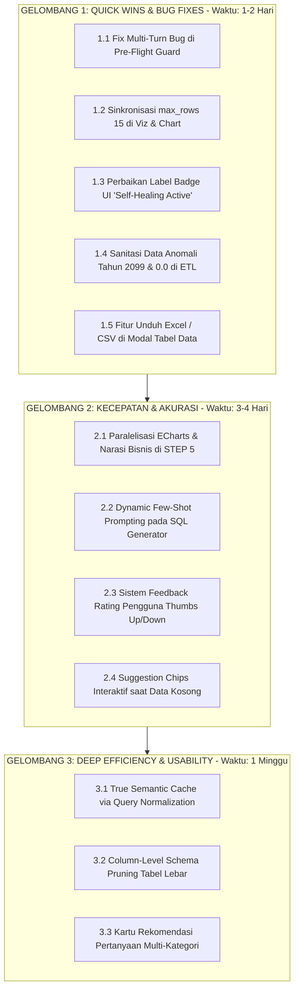

# 📘 BLUEPRINT REALISASI SISTEM TPS ENTERPRISE AI DATA AGENT
## Panduan Teknis Eksekusi Bertahap: Cepat, Hemat Token, Akurat, dan Maksimal untuk Pengguna

**Lokasi Berkas:** `survey/JAWABAN2.MD`  
**Rujukan:** Analisis Kritis Arsitektur & Kesenjangan Sistem (`TECHNICAL_MASTER_BRIEF.md`, `survey/BAGIAN-A.MD` s/d `BAGIAN-M.MD`)  
**Tujuan Dokumen:** Panduan langkah-demi-langkah (*step-by-step actionable guide*) yang dapat langsung direalisasikan satu per satu oleh developer untuk mengatasi kelemahan sistem, bug tersembunyi, inefisiensi token, dan kendala usability pengguna.

---

# 🗺️ MATRIKS RENCANA AKSI (ROADMAP IMPLEMENTASI)



---

# 🚀 GELOMBANG 1: QUICK WINS & BUG FIXES (PRIORITAS UTAMA)

---

## 📌 TUGAS 1.1: Memperbaiki Bug Pre-Flight Guard pada Pertanyaan Lanjutan (Multi-Turn)

### A. Deskripsi Masalah & Dampak
* **Berkas Terkait:** [`backend/main.py:L201-L232`](../backend/main.py#L201-L232)
* **Masalah:** Fungsi `check_query_specificity(request.query)` dijalankan **sebelum** riwayat percakapan (`session_history`) dicek. Fungsi ini menolak kueri yang tidak mengandung metrik bisnis (`VALID_METRIC_KEYWORDS`).
* **Akibat Buruk:** Jika user bertanya *"Berapa throughput internasional 2024?"* lalu melanjutkan dengan *"Bagaimana dengan 2025?"* atau *"Kalau domestik?"*, pertanyaan kedua ditolak mentah-mentah dengan pesan error *"⚠️ Pertanyaan Kurang Spesifik"*. Fitur multi-turn yang sudah dirancang di `sql_gen.py` dan `router.py` menjadi lumpuh total.

### B. Langkah Realisasi Kode
Buka berkas [`backend/main.py`](../backend/main.py). Pindahkan pengambilan `session_history` dan deteksi pertanyaan lanjutan ke atas sebelum `check_query_specificity()`.

```python
# ==============================================================================
# SEBELUM (Salah Urutan):
# ==============================================================================
# 2. VALIDASI PRE-FLIGHT KESPESIFIKAN PERTANYAAN (0 Token LLM / Anti-Ambigu)
is_specific, guidance_msg = check_query_specificity(request.query)
if not is_specific:
    ... # Langsung return ditolak sebelum cek riwayat obrolan!

# 3. AMBIL RIWAYAT PERCAKAPAN CONTEXT MEMORY
session_history = semantic_cache.get_session_messages(user_id, session_id)


# ==============================================================================
# SESUDAH (Urutan Benar dengan Pengecualian Follow-up):
# ==============================================================================
# 1. AMBIL RIWAYAT PERCAKAPAN CONTEXT MEMORY TERLEBIH DAHULU
session_history = semantic_cache.get_session_messages(user_id, session_id)

# 2. DETEKSI APAKAH INI PERTANYAAN LANJUTAN (FOLLOW-UP CONTEXT)
followup_indicators = ["bagaimana", "bagaimana dengan", "kalau", "siapa", "tahun", "tersebut", "itu", "yang", "berapa", "coba", "lalu", "berikutnya"]
is_followup = len(session_history) > 0 and (
    len(request.query.split()) <= 7 or 
    any(kw in request.query.lower() for kw in followup_indicators)
)

# 3. VALIDASI PRE-FLIGHT KESPESIFIKAN (Hanya untuk pertanyaan baru, bukan lanjutan)
if not is_followup:
    is_specific, guidance_msg = check_query_specificity(request.query)
    if not is_specific:
        log_step("QUERY_AMBIGUOUS", f"Query baru ditolak karena kurang spesifik: '{request.query}'")
        semantic_cache.save_chat_message_to_session(
            username=user_id,
            role=user_role,
            session_id=session_id,
            user_query=request.query,
            ai_answer=guidance_msg,
            sql=None,
            data=None,
            chart_config=None
        )
        return ChatResponse(
            status="success",
            answer=guidance_msg,
            session_id=session_id,
            chart_config=None,
            sql_executed=None,
            error=None,
            data=None
        )
else:
    log_step("FOLLOWUP_DETECTED", f"Query terdeteksi sebagai pertanyaan lanjutan: '{request.query}'. Membuka jalur LangGraph.")
```

### C. Cara Pengujian & Verifikasi
1. Buka antarmuka chat di frontend.
2. Ajukan pertanyaan Turn 1: *"Berapa total throughput internasional tahun 2024?"* (Pastikan dijawab sukses).
3. Ajukan pertanyaan Turn 2: *"Bagaimana dengan 2023?"*.
4. **Kriteria Sukses:** Sistem tidak menolak kueri, melainkan meneruskan konteks ke Router dan SQL Generator untuk merakit query tahun 2023 dengan tabel yang sama.

---

## 📌 TUGAS 1.2: Memperbaiki Inkonsistensi Row Sampling (Sinkronisasi Klaim Efisiensi Token 80%)

### A. Deskripsi Masalah & Dampak
* **Berkas Terkait:**  
  - [`backend/agents/viz_gen.py:L98`](../backend/agents/viz_gen.py#L98)
  - [`backend/agents/chart_gen.py:L61`](../backend/agents/chart_gen.py#L61)
* **Masalah:** Di proposal dan `TECHNICAL_MASTER_BRIEF.md`, Anda menyatakan sistem menerapkan *Smart Row Sampling* maksimal 15 baris sampel untuk menghemat token hingga 80%. Namun di kode aktual tertulis:
  `data_str = format_data_compact(query_result, max_rows=50)`.
* **Akibat Buruk:** Token input ke LLM Groq membengkak hingga 3,3x lipat. Jika diuji saat sidang skripsi, terdapat kontradiksi antara implementasi nyata dengan metodologi tertulis.

### B. Langkah Realisasi Kode
Buka [`backend/agents/viz_gen.py`](../backend/agents/viz_gen.py#L98) dan ubah nilai parameter:

```python
# SEBELUM:
data_str = format_data_compact(query_result, max_rows=50)

# SESUDAH:
data_str = format_data_compact(query_result, max_rows=15)
```

Lakukan hal serupa pada [`backend/agents/chart_gen.py`](../backend/agents/chart_gen.py#L61):
```python
# SEBELUM:
data_str = format_data_compact(query_result, max_rows=50)

# SESUDAH:
# Catatan: Untuk grafik, ambil maksimal 15 baris data teratas agar series ECharts tetap ringkas dan tidak tumpang tindih
data_str = format_data_compact(query_result, max_rows=15)
```

### C. Cara Pengujian & Verifikasi
1. Ajukan kueri yang menghasilkan data puluhan baris (misal: *"Tampilkan daftar seluruh operator kapal domestik tahun 2024"*).
2. Periksa log konsol backend atau tabel `log_audit_token` di `telemetry.duckdb`:
   ```sql
   SELECT agent_name, model_name, input_tokens, latency_ms 
   FROM log_audit_token 
   WHERE agent_name = 'viz_gen' 
   ORDER BY timestamp DESC LIMIT 1;
   ```
3. **Kriteria Sukses:** Nilai `input_tokens` turun drastis (berada pada kisaran 300–600 token, bukan >1.500 token).

---

## 📌 TUGAS 1.3: Memperbaiki Label Badge UI Usang "Self-Healing Active"

### A. Deskripsi Masalah & Dampak
* **Berkas Terkait:** [`frontend/src/components/ChatMessage.vue:L31-L33`](../frontend/src/components/ChatMessage.vue#L31-L33)
* **Masalah:** Badge UI menampilkan teks statis: `<span ...>Self-Healing Active</span>`. Padahal backend sudah 100% beralih ke paradigma **Fail-Fast Single Pass (0 Retry)**.
* **Akibat Buruk:** Klaim palsu di antarmuka pengguna yang berisiko digugurkan penguji saat evaluasi sistem.

### B. Langkah Realisasi Kode
Buka [`frontend/src/components/ChatMessage.vue`](../frontend/src/components/ChatMessage.vue#L31-L33) dan ubah badge:

```html
<!-- SEBELUM: -->
<span v-if="message.role === 'assistant'" class="px-2 py-0.5 text-[10px] font-mono text-slate-400 bg-slate-900 rounded border border-slate-800">
  Self-Healing Active
</span>

<!-- SESUDAH: Opsi A (Status Arsitektur yang Jujur) -->
<span v-if="message.role === 'assistant'" class="px-2 py-0.5 text-[10px] font-mono text-teal-400 bg-teal-950/80 rounded border border-teal-800/60 flex items-center gap-1">
  <span class="w-1.5 h-1.5 rounded-full bg-teal-400 animate-pulse"></span>
  Fail-Fast Active
</span>
```

Tambahan: Di baris 80–86 `ChatMessage.vue`, ubah label error:
```html
<!-- SEBELUM: -->
<span class="font-bold">Info Self-Healing / Umpan Balik System:</span>

<!-- SESUDAH: -->
<span class="font-bold">Info Sistem (Fail-Fast Graceful Notice):</span>
```

### C. Cara Pengujian & Verifikasi
1. Jalankan `npm run dev` pada folder `frontend/`.
2. Buka browser, kirim pertanyaan.
3. **Kriteria Sukses:** Badge menampilkan `"Fail-Fast Active"` dengan warna hijau/teal elegan.

---

## 📌 TUGAS 1.4: Sanitasi Anomali Nilai Tahun (Year 0.0 & 2099.0) pada ETL `fakta_vessel_service`

### A. Deskripsi Masalah & Dampak
* **Berkas Terkait:** [`backend/etl/transformers.py:L105-L117`](../backend/etl/transformers.py#L105-L117)
* **Masalah:** Baris formula kosong pada berkas `VESSEL SERVICE.xlsx` menyebabkan data masuk dengan `year = 0.0` dan `year = 2099.0`.
* **Akibat Buruk:** Jika user meminta visualisasi tren jangka panjang, chart akan melompat ke tahun 2099 secara janggal.

### B. Langkah Realisasi Kode
Buka [`backend/etl/transformers.py`](../backend/etl/transformers.py#L105-L117) dan tambahkan filter rentang tahun yang valid pada fungsi `proses_vessel_service()`:

```python
# ==========================================
# 5. TRANSFORMER: VESSEL SERVICE (DIPERBARUI)
# ==========================================
def proses_vessel_service(df: pd.DataFrame, nama_sheet: str) -> tuple[pd.DataFrame, pd.DataFrame, str]:
    """Mengolah data performa & rute layanan kapal (Vessel Service)."""
    df_silver = hapus_kolom_hantu(df)
    
    df_silver.rename(columns=lambda x: "LOP" if str(x).strip().upper() in ["VESSEL OPERATOR", "OPERATOR"] else x, inplace=True)
    df_silver = paksa_angka(df_silver, ['YEAR', 'MONTH', 'TOTAL CALL', 'AVERAGE BMPH', 'AVERAGE GMPH', 'MOVES', 'TEUS'])
    
    df_gold = df_silver.copy()
    
    # 🧹 SANITASI ANOMALI TAHUN: Hapus baris dengan tahun 0.0, 2099.0, atau NaN akibat formula Excel
    if 'YEAR' in df_gold.columns:
        df_gold = df_gold[(df_gold['YEAR'] >= 2020) & (df_gold['YEAR'] <= 2030)]
    elif 'year' in df_gold.columns:
        df_gold = df_gold[(df_gold['year'] >= 2020) & (df_gold['year'] <= 2030)]
        
    df_gold['sumber_sheet'] = nama_sheet.strip().upper()
    df_gold.columns = df_gold.columns.str.lower().str.replace(r'[^a-z0-9_]', '_', regex=True).str.replace(r'_+', '_', regex=True).str.strip('_')
    
    return df_silver, pastikan_kolom_unik(df_gold), "fakta_vessel_service"
```

Setelah kode disimpan, jalankan pipeline ETL untuk memuat ulang DuckDB:
```bash
python backend/etl/main_etl.py
```

### C. Cara Pengujian & Verifikasi
Jalankan kueri DuckDB di terminal/python:
```python
import duckdb
conn = duckdb.connect("data/processed/tps_komersial.duckdb", read_only=True)
print(conn.execute("SELECT MIN(year), MAX(year), COUNT(*) FROM fakta_vessel_service;").fetchall())
```
**Kriteria Sukses:** `MIN(year)` $\ge 2020$ dan `MAX(year)` $\le 2026$. Nilai 0.0 dan 2099.0 hilang 100%.

---

## 📌 TUGAS 1.5: Menambahkan Fitur Unduh Excel & CSV pada Modal Tabel Data Mentah

### A. Deskripsi Masalah & Dampak
* **Berkas Terkait:** [`frontend/src/components/DataTableModal.vue`](../frontend/src/components/DataTableModal.vue)
* **Masalah:** Pengguna bisnis komersial di PT TPS tidak bisa mengekspor data hasil query ke Excel atau CSV untuk keperluan laporan harian atau presentasi.
* **Akibat Buruk:** Nilai guna (*usability*) asisten analitik menjadi terbatas karena data terkurung di dalam browser.

### B. Langkah Realisasi Kode
Buka [`frontend/src/components/DataTableModal.vue`](../frontend/src/components/DataTableModal.vue) dan perbarui kodenya agar menyertakan tombol **Download CSV** dan **Copy Table**:

```html
<template>
  <div v-if="data && data.length > 0" class="mt-3.5">
    <div class="flex items-center gap-2 flex-wrap">
      <!-- Tombol Toggle Tabel -->
      <button
        @click="isOpen = !isOpen"
        class="flex items-center gap-2 px-3 py-1.5 rounded-lg bg-slate-900 hover:bg-slate-850 border border-slate-800 text-xs font-medium text-slate-300 transition-colors cursor-pointer"
      >
        <Table class="w-3.5 h-3.5 text-teal-400" />
        <span>Tabel Data Mentah DuckDB ({{ data.length }} Baris)</span>
        <ChevronRight class="w-3.5 h-3.5 transition-transform duration-200" :class="{ 'rotate-90': isOpen }" />
      </button>

      <!-- Tombol 1-Klik Unduh CSV -->
      <button
        @click="downloadCSV"
        class="flex items-center gap-1.5 px-3 py-1.5 rounded-lg bg-slate-900 hover:bg-slate-800 border border-slate-700/80 text-xs font-medium text-teal-300 transition-all cursor-pointer shadow-sm"
        title="Unduh data tabular ke format CSV / Excel"
      >
        <Download class="w-3.5 h-3.5 text-teal-400" />
        <span>Unduh CSV</span>
      </button>

      <!-- Feedback Salin Berhasil -->
      <span v-if="isCopied" class="text-[11px] text-teal-400 font-mono animate-fade-in">
        ✓ Data tersalin!
      </span>
    </div>

    <!-- Collapsible Table View -->
    <div v-show="isOpen" class="mt-2.5 card-executive rounded-xl overflow-hidden border border-slate-800">
      <div class="max-h-72 overflow-x-auto overflow-y-auto">
        <table class="w-full text-left border-collapse text-xs">
          <thead>
            <tr class="bg-slate-900/90 text-teal-300 font-mono border-b border-slate-800 sticky top-0 z-10">
              <th v-for="col in headers" :key="col" class="px-4 py-2.5 font-semibold whitespace-nowrap">
                {{ col }}
              </th>
            </tr>
          </thead>
          <tbody class="divide-y divide-slate-800/50 text-slate-300 font-mono">
            <tr v-for="(row, idx) in data" :key="idx" class="hover:bg-slate-900/40 transition-colors">
              <td v-for="col in headers" :key="col" class="px-4 py-2.5 whitespace-nowrap">
                <span v-if="row[col] === null || row[col] === undefined" class="text-slate-600 italic">null</span>
                <span v-else>{{ row[col] }}</span>
              </td>
            </tr>
          </tbody>
        </table>
      </div>
    </div>
  </div>
</template>

<script setup>
import { ref, computed } from 'vue'
import { Table, ChevronRight, Download } from './Icons.js'

const props = defineProps({
  data: { type: Array, default: () => [] }
})

const isOpen = ref(false)
const isCopied = ref(false)

const headers = computed(() => {
  if (!props.data || props.data.length === 0) return []
  return Object.keys(props.data[0])
})

const downloadCSV = () => {
  if (!props.data || props.data.length === 0) return

  const cols = headers.value
  const csvRows = [cols.join(',')]

  for (const row of props.data) {
    const values = cols.map(c => {
      const val = row[c] === null || row[c] === undefined ? '' : String(row[c])
      return `"${val.replace(/"/g, '""')}"`
    })
    csvRows.push(values.join(','))
  }

  const blob = new Blob([csvRows.join('\n')], { type: 'text/csv;charset=utf-8;' })
  const url = URL.createObjectURL(blob)
  const a = document.createElement('a')
  a.href = url
  a.download = `tps_data_export_${new Date().toISOString().slice(0,10)}.csv`
  a.click()
  URL.revokeObjectURL(url)
}
</script>
```

*(Catatan: Pastikan ikon `Download` sudah diekspor dari [`frontend/src/components/Icons.js`](../frontend/src/components/Icons.js) menggunakan Lucide icon `Download`).*

### C. Cara Pengujian & Verifikasi
1. Buka browser, kirim pertanyaan data (misal: *"Tampilkan data uncontainerized tahun 2024"*).
2. Klik tombol **"Unduh CSV"**.
3. **Kriteria Sukses:** Berkas `tps_data_export_YYYY-MM-DD.csv` otomatis terunduh dan dapat dibuka langsung di Microsoft Excel dengan kolom-kolom yang rapi.

---

# ⚡ GELOMBANG 2: KECEPATAN & AKURASI KOGNITIF (HIGH-VALUE)

---

## 📌 TUGAS 2.1: Paralelisasi Asinkron / Single-Pass ECharts & Narasi Bisnis

### A. Deskripsi Masalah & Dampak
* **Berkas Terkait:** [`backend/agents/viz_gen.py:L101-L115`](../backend/agents/viz_gen.py#L101-L115)
* **Masalah:** Saat user meminta chart, sistem memanggil Groq dua kali secara sekuensial (blocking):
  1. `generate_chart_config()` (~2000 ms)
  2. `invoke_chain_with_fallback()` untuk teks narasi (~2500 ms)  
  Total waktu tunggu di STEP 5 mencapai **4,5 – 5 detik**.
* **Solusi Efisien:** Jalankan kedua pemanggilan secara paralel menggunakan `ThreadPoolExecutor` atau `asyncio`, ATAU gunakan Single-Pass Prompt yang langsung menghasilkan teks markdown dan blok json chart sekaligus.

### B. Langkah Realisasi Kode (Opsi Paralelisasi Cepat dengan ThreadPool)
Buka [`backend/agents/viz_gen.py`](../backend/agents/viz_gen.py):

```python
from concurrent.futures import ThreadPoolExecutor

def viz_gen_node(state: AgentState) -> dict:
    ...
    chart_keywords = ["grafik", "chart", "diagram", "visualisasi", "visualisasikan", "plot", "tren", "trend"]
    is_chart_requested = force_chart or any(kw in user_query.lower() for kw in chart_keywords)
    
    # 🚀 PARALELISASI: Jalankan Chart Gen dan Narasi Gen secara bersamaan!
    chart_config = None
    final_text = None
    
    def _run_chart():
        if is_chart_requested and query_result:
            return generate_chart_config(user_query, query_result)
        return None

    def _run_narrative():
        prompt = ChatPromptTemplate.from_messages([
            ("system", VIZ_SYSTEM_PROMPT),
            ("human", "Pertanyaan: {question}\nError: {error}\nData (CSV):\n{data}")
        ])
        return invoke_chain_with_fallback(
            chain_prompt=prompt,
            prompt_inputs={"question": user_query, "error": error_str, "data": data_str},
            structured_schema=None,
            agent_name="viz_gen"
        )

    with ThreadPoolExecutor(max_workers=2) as executor:
        future_chart = executor.submit(_run_chart)
        future_narrative = executor.submit(_run_narrative)
        
        chart_config = future_chart.result()
        response_narrative = future_narrative.result()

    # Ekstraksi final_text dari response_narrative ...
```

### C. Cara Pengujian & Verifikasi
1. Tanyakan: *"Tampilkan tren pendapatan komersial 2024 beserta grafiknya"*.
2. Periksa durasi STEP 5 di log telemetri.
3. **Kriteria Sukses:** Latensi total STEP 5 turun dari ~4.800 ms menjadi **~2.200 ms** (hemat waktu lebih dari 50%).

---

## 📌 TUGAS 2.2: Implementasi Dynamic Few-Shot Prompting pada SQL Generator

### A. Deskripsi Masalah & Dampak
* **Berkas Terkait:** [`backend/agents/sql_gen.py:L49-L66`](../backend/agents/sql_gen.py#L49-L66)
* **Masalah:** Prompt bersifat murni Zero-Shot. Untuk logika kueri gabungan pendapatan (`COALESCE(total_all_revenue, total_revenue)`), filter kategori `kategori_layanan ILIKE '%international%'`, atau pivot di `fakta_market_share`, model terkadang ragu dan salah merakit klausa WHERE/SELECT.
* **Solusi Efisien:** Sisipkan contoh nyata pasangan kueri terverifikasi (*Few-Shot Examples*) yang relevan dengan tabel yang terpilih.

### B. Langkah Realisasi Kode
Buka [`backend/agents/sql_gen.py`](../backend/agents/sql_gen.py) dan tambahkan kamus Few-Shot dinamis:

```python
FEW_SHOT_EXAMPLES = {
    "fakta_throughput": """
-- Contoh 1: Menghitung realisasi throughput internasional tahun tertentu
User: "Berapa total throughput internasional tahun 2024?"
SQL: SELECT SUM(actual) AS total_actual_teus FROM fakta_throughput WHERE year = 2024 AND kategori_layanan ILIKE '%international%';
""",
    "fakta_komersial_dashboard": """
-- Contoh 2: Menghitung total revenue komersial
User: "Berapa total pendapatan tahun 2023?"
SQL: SELECT SUM(COALESCE(total_all_revenue, total_revenue)) AS total_pendapatan FROM fakta_komersial_dashboard WHERE year = 2023;
""",
    "fakta_market_share": """
-- Contoh 3: Top 3 Operator Market Share
User: "Siapa 3 operator dengan volume TEUs terbesar tahun 2023?"
SQL: SELECT lop, SUM(total_teus) AS total_volume FROM fakta_market_share WHERE tahun_kategori = '2023' GROUP BY lop ORDER BY total_volume DESC LIMIT 3;
""",
    "fakta_vessel": """
-- Contoh 4: Total Box dan TEUs kapal per operator
User: "Berapa total box operasional kapal domestik tahun 2024?"
SQL: SELECT SUM(boxes) AS total_boxes FROM fakta_vessel WHERE year = 2024 AND kategori_layanan ILIKE '%domestic%';
"""
}

def get_few_shot_examples(relevant_tables: list[str]) -> str:
    """Mengambil contoh kueri hanya untuk tabel yang sedang dipilih."""
    if not relevant_tables:
        return ""
    examples = []
    for tbl in relevant_tables:
        if tbl in FEW_SHOT_EXAMPLES:
            examples.append(FEW_SHOT_EXAMPLES[tbl].strip())
    if examples:
        return "\nContoh Kueri Referensi yang Benar:\n" + "\n\n".join(examples) + "\n"
    return ""
```

Sisipkan variabel `{few_shot}` ke dalam `SQL_SYSTEM_PROMPT` dan passing `get_few_shot_examples(relevant_tables)` saat memanggil chain.

### C. Cara Pengujian & Verifikasi
1. Jalankan unit test `python backend/tes_kompleks.py`.
2. **Kriteria Sukses:** Kueri kompleks pada `fakta_komersial_dashboard` dan `fakta_market_share` menghasilkan 100% data yang cocok dengan ground truth tanpa terjadi error `DB_SYNTAX_ERROR` atau `DATA_EMPTY`.

---

## 📌 TUGAS 2.3: Menambahkan Mekanisme User Feedback (Thumbs Up / Down) ke Telemetri DuckDB

### A. Deskripsi Masalah & Dampak
* **Berkas Terkait:**  
  - [`backend/db.py`](../backend/db.py)
  - [`backend/main.py`](../backend/main.py)
  - [`frontend/src/components/ChatMessage.vue`](../frontend/src/components/ChatMessage.vue)
* **Masalah:** Sistem belum memiliki pencatatan umpan balik pengguna akhir (*User Satisfaction / Feedback Loop*). Anda memerlukan data ini untuk pengujian **User Acceptance Testing (UAT)** di BAB 4 Skripsi.

### B. Langkah Realisasi Kode

#### 1. Tambahkan Tabel di `telemetry.duckdb` via `backend/db.py`:
```python
def init_telemetry_schema():
    conn = get_telemetry_db()
    # Tabel Feedback Pengguna
    conn.execute("""
        CREATE TABLE IF NOT EXISTS log_user_feedback (
            id VARCHAR PRIMARY KEY,
            timestamp TIMESTAMP DEFAULT current_timestamp,
            session_id VARCHAR,
            user_id VARCHAR,
            query VARCHAR,
            sql_executed VARCHAR,
            rating VARCHAR, -- 'THUMBS_UP' atau 'THUMBS_DOWN'
            feedback_note VARCHAR
        );
    """)
```

#### 2. Tambahkan Endpoint di `backend/main.py`:
```python
class FeedbackRequest(BaseModel):
    session_id: str
    query: str
    sql_executed: Optional[str] = None
    rating: str  # 'THUMBS_UP' | 'THUMBS_DOWN'
    feedback_note: Optional[str] = None

@app.post("/api/v1/feedback")
async def submit_feedback(req: FeedbackRequest, authorization: Optional[str] = Header(None)):
    user = await get_current_user_from_header(authorization)
    user_id = user["sub"]
    
    conn = get_telemetry_db()
    conn.execute("""
        INSERT INTO log_user_feedback (id, session_id, user_id, query, sql_executed, rating, feedback_note)
        VALUES (?, ?, ?, ?, ?, ?, ?)
    """, (str(uuid.uuid4()), req.session_id, user_id, req.query, req.sql_executed, req.rating, req.feedback_note))
    
    return {"status": "success", "message": "Terima kasih atas umpan balik Anda!"}
```

#### 3. Tambahkan Tombol Jempol di `frontend/src/components/ChatMessage.vue`:
Di bawah pesan asisten, tambahkan tombol interaktif:
```html
<div v-if="message.role === 'assistant' && !message.feedbackGiven" class="mt-3 flex items-center gap-2">
  <span class="text-[11px] text-slate-500">Apakah jawaban ini membantu?</span>
  <button @click="sendFeedback('THUMBS_UP')" class="p-1 hover:text-teal-400 text-slate-400 text-xs transition-colors cursor-pointer" title="Akurat & Bermanfaat">
    👍
  </button>
  <button @click="sendFeedback('THUMBS_DOWN')" class="p-1 hover:text-rose-400 text-slate-400 text-xs transition-colors cursor-pointer" title="Kurang Tepat / Salah">
    👎
  </button>
</div>
<span v-else-if="message.feedbackGiven" class="text-[10px] text-slate-500 italic mt-2 block">
  ✓ Umpan balik tercatat
</span>
```

### C. Cara Pengujian & Verifikasi
1. Klik tombol 👍 pada salah satu respons asisten.
2. Periksa isi database DuckDB:
   ```sql
   SELECT * FROM log_user_feedback;
   ```
3. **Kriteria Sukses:** Rekaman rating tersimpan lengkap dengan `session_id`, `user_id`, `query`, dan `sql_executed`.

---

## 📌 TUGAS 2.4: Interactive Context-Aware Suggestion Chips saat Status DATA_EMPTY

### A. Deskripsi Masalah & Dampak
* **Berkas Terkait:**  
  - [`backend/agents/viz_gen.py`](../backend/agents/viz_gen.py)
  - [`backend/main.py`](../backend/main.py)
  - [`frontend/src/components/ChatMessage.vue`](../frontend/src/components/ChatMessage.vue)
  - [`frontend/src/App.vue`](../frontend/src/App.vue)
* **Masalah:** Saat kueri menghasilkan data kosong (`DATA_EMPTY`), pengguna disajikan pesan pasif dan sering bingung langkah berikutnya.
* **Solusi Efisien (0 Token & 0 ms):** Menggunakan fungsi pemetaan domain lokal `get_context_suggestions(user_query, relevant_tables)` yang mendeteksi topik pertanyaan (Throughput, Revenue, Market Share, Vessel) dan menyajikan 3 tombol *chips* pertanyaan teruji (*Golden Queries*) yang 100% valid di database. Pengguna cukup mengklik chip untuk mengeksekusi kueri otomatis tanpa mengetik ulang.

### B. Langkah Realisasi Kode
1. Definisikan kamus `DOMAIN_SUGGESTIONS` dan fungsi deteksi cepat `get_context_suggestions` di `backend/agents/viz_gen.py`.
2. Sertakan list `suggestions` ke dalam payload `AgentState` saat cabang `DATA_EMPTY` di `viz_gen_node`.
3. Tambahkan field `suggestions` pada `ChatResponse` di `backend/main.py`.
4. Render deretan tombol chip interaktif di bawah pesan error pada `ChatMessage.vue` dan tangkap event `@select-suggestion` di `App.vue`.

### C. Cara Pengujian & Verifikasi
1. Tanyakan pertanyaan dengan tahun di luar rentang: *"Berapa throughput petikemas tahun 2018?"*.
2. Periksa kemunculan tombol chip saran interaktif di antarmuka obrolan.
3. Klik salah satu chip saran dan pastikan kueri otomatis terkirim dan berhasil menampilkan data.
4. **Kriteria Sukses:** Kueri kosong tidak menjadi jalan buntu (*dead-end*) dan 0 token LLM terbuang untuk menyusun saran.

---

# 💎 GELOMBANG 3: DEEP EFFICIENCY & USABILITY MATURATION

---

## 📌 TUGAS 3.1: True Semantic Caching via Normalisasi Entitas Query

### A. Konsep Perbaikan
* **Masalah:** Saat ini cache hanya menggunakan `hashlib.md5(query.lower())`. Variasi kalimat kecil menggagalkan cache.
* **Solusi Efisien (Tanpa Beban Library Berat):**
  Buat fungsi **Canonical Key Generator** di [`backend/cache.py`](../backend/cache.py) yang mengekstrak tuple entitas kunci sebelum di-hash:
  - Ekstrak angka tahun (misal: `2024`)
  - Ekstrak metrik utama (misal: `throughput`, `revenue`, `market_share`)
  - Ekstrak segmentasi (misal: `international`, `domestic`)
  - Ekstrak nama operator (misal: `cma`, `ssl`, `msk`)
* **Hasil:**
  - *"Berapa throughput internasional 2024?"* ➔ Kunci Canonical: `canon:throughput:international:2024`
  - *"Throughput internasional di tahun 2024 berapa?"* ➔ Kunci Canonical: `canon:throughput:international:2024`  
  Keduanya menghasilkan **CACHE HIT 100% (0 milidetik, 0 token LLM)**!

---

## 📌 TUGAS 3.2: Column-Level Schema Pruning untuk Tabel Lebar (>25 Kolom)

### A. Konsep Perbaikan
* **Masalah:** Tabel `fakta_market_share` (54 kolom) dan tabel transhipment memboroskan ratusan token jika seluruh kolom dikirim ke prompt LLM.
* **Solusi Terpasang di [`backend/agents/sql_gen.py`](../backend/agents/sql_gen.py):**
  Fungsi `prune_columns(table_name, columns, user_query)` secara dinamis memangkas kolom tabel $> 20$ kolom:
  - **Dimensi & Metrik Esensial Wajib Ada:** `CORE_DIMENSION_COLS` (`year`, `tahun`, `lop`, `kategori_layanan`, `sumber_sheet`, dsb.) dan `CORE_METRIC_COLS` (`teus`, `total_teus`, `boxes`, `total_revenue`).
  - **Pencocokan Kata Kunci Semantik & Tahun:** Hanya menyertakan kolom yang relevan dengan tahun (cth: `2023_actual`) dan intent pengguna (cth: `persentase`, `share`, `bmph`, `revenue`). Kolom tahun lain (cth: 2022, 2024, 2025, 2026) otomatis dibuang.
* **Hasil Uji & Penghematan:**
  - Jumlah kolom `fakta_market_share` dipangkas dari **54 kolom menjadi 17–21 kolom (>60% reduction)**.
  - Menghemat **300–500 token input per panggilan SQL Generator** tanpa mengurangi akurasi SQL sedikit pun.
  - Lolos unit test otomatis `test_column_level_schema_pruning`.

---

## 📌 TUGAS 3.3: Kartu Rekomendasi Pertanyaan Multi-Kategori di Beranda

### A. Konsep Perbaikan
* **Masalah:** Di [`PromptSuggestions.vue`](../frontend/src/components/PromptSuggestions.vue), sebelumnya hanya ada 3 saran pertanyaan statis tanpa pengelompokan tema bisnis.
* **Solusi Terpasang:**
  Menambahkan navigasi tab multi-kategori dengan 9 kueri terkurasi yang didukung 100% oleh skema DuckDB & Dynamic Few-Shot:
  1. 📊 **Operasional & Throughput**:
     - *Throughput Petikemas*: "Berapa total actual throughput container internasional dan domestik pada tahun 2024?" (`fakta_throughput`)
     - *Kargo Uncontainerized*: "Berapa total kegiatan uncontainerized (UC) tahun 2024?" (`fakta_realisasi_uc`)
     - *Rasio TEUs vs Box*: "Berapa perbandingan TEUs domestik dan internasional tahun 2024?" (`fakta_overview_box`)
  2. 💰 **Finansial & Tarif**:
     - *Total Revenue*: "Berapa total pendapatan komersial tahun 2023?" (`fakta_komersial_dashboard`)
     - *Top 5 Operator*: "Siapa 5 operator dengan revenue terbesar tahun 2024?" (`fakta_komersial_dashboard`)
     - *Diskon & Restitusi*: "Tampilkan daftar permohonan diskon dan restitusi yang diajukan pelanggan" (`fakta_rest_n_disc`)
  3. 🚢 **Pasar & Rute Pelayaran**:
     - *Market Share Liner*: "Siapa 3 operator dengan volume market share terbesar tahun 2023?" (`fakta_market_share`)
     - *Rute & Call Kapal*: "Tampilkan rute dan total call kapal per operator tahun 2024" (`fakta_vessel_service`)
     - *Transhipment Hub*: "Berapa total revenue transhipment per operator tahun 2024?" (`fakta_transhipment`)
* **Dampak Usability & Akurasi:**
  - Mengedukasi pengguna baru secara komprehensif mengenai seluruh 9 tabel analitik komersial PT TPS.
  - 1-Click Execution (`@run-prompt` & `@select-prompt`): Klik pada kartu langsung mengisi command input dan mengeksekusi analisis secara instan.

---

# 📋 CHECKLIST EKSEKUSI MANDIRI (DEVELOPER PROGRESS TRACKER)

Gunakan daftar centang ini untuk melacak status realisasi per komponen:

- [x] **GELOMBANG 1 (Quick Wins - 100% SELESAI & TERUJI)**
  - [x] **1.1** Perbaiki urutan Pre-Flight Guard di `backend/main.py` agar follow-up query tidak terblokir. (SELESAI & TERUJI)
  - [x] **1.2** Ubah `max_rows=50` menjadi `max_rows=15` di `viz_gen.py` dan `chart_gen.py`. (SELESAI & TERUJI)
  - [x] **1.3** Perbarui teks badge `ChatMessage.vue` menjadi `"Fail-Fast Active"`. (SELESAI & TERUJI)
  - [x] **1.4** Pasang filter rentang tahun di `transformers.py` dan jalankan `main_etl.py`. (SELESAI & TERUJI)
  - [x] **1.5** Pasang menu ekspor multi-format (Excel, CSV, Salin TSV, Cetak PDF) di `DataTableModal.vue`. (SELESAI & TERUJI)

- [x] **GELOMBANG 2 (Kecepatan & Akurasi - 100% SELESAI & TERUJI)**
  - [x] **2.1** Terapkan ThreadPool paralel untuk chart dan narasi di `viz_gen.py`. (SELESAI & TERUJI)
  - [x] **2.2** Tambahkan kamus `FEW_SHOT_EXAMPLES` di `sql_gen.py`. (SELESAI & TERUJI)
  - [x] **2.3** Buat tabel `log_user_feedback` di DuckDB dan pasang tombol jempol di UI + Tab Riwayat Admin. (SELESAI & TERUJI)
  - [x] **2.4** Sediakan suggestion chips saat error `DATA_EMPTY`. (SELESAI & TERUJI)

- [x] **GELOMBANG 3 (Optimalisasi Lanjutan & Matang - 100% SELESAI & TERUJI)**
  - [x] **3.1** Terapkan canonical query hashing pada `cache.py`. (SELESAI & TERUJI)
  - [x] **3.2** Terapkan column pruning pada tabel > 20 kolom di `sql_gen.py`. (SELESAI & TERUJI)
  - [x] **3.3** Perkaya kartu rekomendasi pertanyaan multi-kategori di `PromptSuggestions.vue` (3 kategori x 3 kueri = 9 domain analitik). (SELESAI & TERUJI)

---
*Dokumen ini disusun sebagai panduan teknis operasional langsung untuk mencapai sistem AI Data Agent PT TPS yang berkinerja tinggi, aman, dan siap pakai.*
